SEPAL-SDG 15.4.2 :sub:`beta`
============================

*SEPAL-SDG 15.4.2 :sub:`beta` is a tool to support the computation of SDG Indicator 15.4.2 namely: (a) **Mountain Green Cover Index** and (b) **Proportion of Degraded Mountain Land** using SEPAL (System for Earth Observation Data Access, Processing, and Analysis for Land Monitoring)*

This guide will introduce you to SEPAL-SDG 15.4.2 :sub:`beta` , provide detailed instructions on setting-up the tool and computing both sub-indicators step-by-step with screenshots included for better comprehension.

General Information
-------------------

About SEPAL-SDG 15.4.2 :sub:`beta`
^^^^^^^^^^^^^^^^^^^^^^^^^^^^^^^^^^

SEPAL-SDG 15.4.2 :sub:`beta` has been developed by the Food and Agriculture Organization (FAO) of the United Nations to support national authorities to compute and report against SDG Indicator 15.4.2. 

SEPAL-SDG 15.4.2 :sub:`beta` is built on **SEPAL**, an open-source cloud-based platform that allows users to query and process satellite data quickly and efficiently, tailor products for local needs, and produce sophisticated and relevant geospatial analyses quickly.
To know more about SEPAL visit the `SEPAL website <https://docs.sepal.io/en/latest/>`_.

SEPAL-SDG 15.4.2 :sub:`beta` is still in its beta stage ; therefore,undergoing development. If you have specific bugs to report or improvements to the tool that you would like to suggest, please use the `GitHub’s issue tracker <https://github.com/dfguerrerom/sepal_mgci/issues>`_ of SEPAL-SDG 15.4.2 :sub:`beta` following these `contribution guidelines <https://github.com/dfguerrerom/sepal_mgci/blob/master/CONTRIBUTE.md>`_.

Authors
^^^^^^^

SEPAL-SDG 15.4.2 :sub:`beta` has been developed by the Food and Agriculture Organization (FAO) of the United Nations,funded by the Norway's International Climate and Forest Iniciative (NICFI).

SEPAL-SDG 15.4.2 :sub:`beta` has been developed by Daniel Guerrero. Ann Cheptoo Rotich developed the technical documentation. Xavier de Lamo led and supervised the development of both products.

License
^^^^^^^
SEPAL-SDG 15.4.2 :sub:`beta` is a free and open source tool licensed under the `MIT license <https://opensource.org/licenses/MIT>`_. The documentation is made available under the terms of the `Creative Commons Attribution 4.0 International License (CC BY 4.0) <https://creativecommons.org/licenses/by/4.0/>`_. 

.. _DataSources:

Data Sources
^^^^^^^^^^^^
SEPAL-SDG 15.4.2 :sub:`beta` draws on a number of global data sources to allow the computation of the SDG 15.4.2 indicator when similar national data is not available. The datasets described below have been made available by the following organizations under separate terms as indicated in their respective metadata:

- **Land cover**: European Space Agency (ESA) Climate Change Initiative (CCI) Land cover maps, available at `ESA-CCI land cover website <https://maps.elie.ucl.ac.be/CCI/viewer/index.php>`_.
- **Digital Elevation Model**: The Shuttle Radar Topography Mission (SRTM), available at `Google Earth Engine Data SRTM <https://developers.google.com/earth-engine/datasets/catalog/CGIAR_SRTM90_V4>`_.
- **Administrative Boundaries**: FAO GAUL: Global Administrative Unit Layers 2015, available at `Google Earth Engine Data FAO GAUL <https://developers.google.com/earth-engine/datasets/catalog/FAO_GAUL_2015_level1>`_.

.. note:: The Administrative Boundaries provided in this tool are in the public domain. The designations employed and the presentation of material on this map do not imply the expression of any opinion whatsoever on the part of the Secretariat of the United Nations concerning the legal status of any country, territory, city or area or its authorities, or concerning the delimitation of its frontiers or boundaries. If using SEPAL-SDG 15.4.2 :sub:`beta` for official purposes, it is recommended that users use an official boundary provided by the designated office of their country.

Before using SEPAL-SDG 15.4.2 :sub:`beta`
-----------------------------------------

Initial Setup
^^^^^^^^^^^^^
SEPAL is closely linked to Google Earth Engine (GEE), a Google-powered Earth-observation cloud-computing platform, as it builds in many of its functionalities. This means that to run SEPAL-SDG 15.4.2 :sub:`beta` you will need to have **connected SEPAL and GEE accounts**.

Before getting started with SEPAL-SDG 15.4.2 :sub:`beta` you need:

- To **Create a SEPAL account** please follow the `registration steps described here <https://docs.sepal.io/en/latest/setup/register.html#sign-up-to-sepal>`_ and then familiarize yourself with the tool by exploring its interface.
- To **Create a Google Earth Engine (GEE) account** please follow these `steps <https://docs.sepal.io/en/latest/setup/gee.html#create-a-gee-account>`_ and don't forget to `initialize the home folder <https://docs.sepal.io/en/latest/setup/gee.html#initialize-the-home-folder>`_.
- To **Connect your SEPAL and GEE accounts** follow the `instructions described here <https://docs.sepal.io/en/latest/setup/gee.html#connection-between-gee-and-sepal>`_

Data Requirements
^^^^^^^^^^^^^^^^^
SDG Indicator 15.4.2 requires several spatial data inputs to be computed namely :

- **A Mountain Area Map** 
  
For the purposes of standardization and international comparability of indicators values, SDG Indicator 15.4.2 adheres to the UNEP-WCMC mountain definition (UNEP-WCMC, 2002). The UNEP-WCMC method defines total global mountain area as the sum of seven classes (commonly known as ‘Kapos mountain classes’), based on elevation, slope and local elevation ranges parameters. This mountain area is subdivided into bioclimatic belts (Nival, Alpine, Montane, and Remaining Mountain Area) based on average temperatures as defined by Körner et al. (2011). A global mountain area map based on these definitions and methodologies has been developed by FAO and is used by default by SEPAL-SDG 15.4.2 :sub:`beta` as part of the computations. 

- **A National Administrative Boundary for the country of interest** 
  
SEPAL-SDG 15.4.2 :sub:`beta` has been conceived to facilitate the computation of SDG Indicator 15.4.2 at country level. To facilitate this , SEPAL-SDG 15.4.2 :sub:`beta` uses a default global data source for national boundaries - the FAO GAUL Global Administrative Unit Layers 2015 data set. However, the tool also allows national agencies to use their own national country boundary layer if available. 

- **A collection of Land Cover Maps for the country of interest** 
  
Land cover maps represent spatially the physical coverage of the Earth's surface into different types (classes) e.g. forests, grasslands, croplands, lakes, wetlands. This data serves different functions for SDG Indicator 15.4.2: 
  
**In Sub-Indicator 15.4.2a**, land cover is used to categorize land into green and non-green cover areas. 
  
**In Sub-Indicator 15.4.2b**, land cover is used to identify areas where changes in the type of land cover may indicate a decline or loss of biodiversity, mountain ecosystem functions or services that are considered desirable in a local or national context. 
 
The collection of land cover maps to compute this indicator should be available from the year **2000**. SEPAL SDG 15.4.2 :sub:`beta` facilitates national authorities to use relevant national or regional land cover datasets. 
Similar to the national administrative boundary dataset, SEPAL-SDG 15.4.2 :sub:`beta` provides access to default land cover datasets, selected by FAO to compute the indicator when national datasets are not available see the :ref:`Data Sources section <DataSources>`
  
.. Note:: 
   Country-defined datasets must be made available as GEE assets as an `image collection <https://developers.google.com/earth-engine/guides/ic_creating>`_ for SEPAL-SDG 15.4.2       :sub:`beta` to access it. This will be demonstrated in the next section of the tutorial. 
 

Uploading files into Google Earth Engine
^^^^^^^^^^^^^^^^^^^^^^^^^^^^^^^^^^^^^^^^
Once you have created accounts in both SEPAL and GEE and linked them accordingly,you will now learn how to upload files into GEE.
GEE accepts a number of data formats namely: shapefiles, raster images,and CSV tables. This section will demonstrate the uploading of the different data types into the platform.

1. To upload files,go to the **Assets** tab in the top left panel in the **Earth Engine Code Editor** page. Clicking on it will open the **Asset Manager** as shown below:

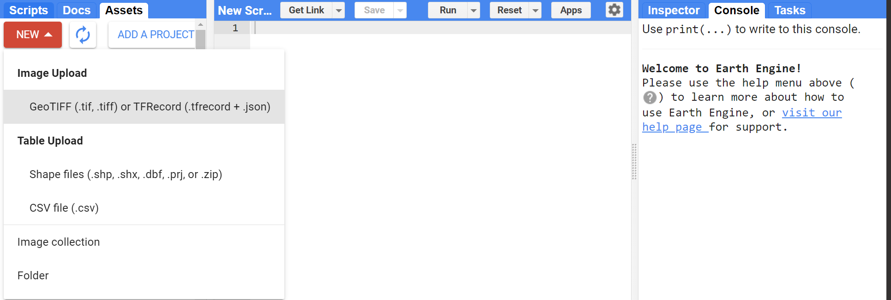

2. Clicking on the  **New** button will list the acceptable options, including **Raster** (Geotiffs or TFRecords), **Vector** (Shapefiles) and **Data tables** (CSV files), which will be described in the following subsections.

2.1.Uploading Vector Files
~~~~~~~~~~~~~~~~~~~~~~~~~~

.. Note::
   In SEPAL-SDG 15.4.2 :sub:`beta` custom country boundaries need to be uploaded in vector format.

1. To do so, choose the **Shapefiles** option in the drop-down list. A pop-up window will appear prompting you to navigate to the location of your data.
2. Select the file you want to upload from your computer.You can either upload the vector data as a compressed file :code:`.zip` or :code:`.shp` .Remember that a :code:`.shp` file alone is not sufficient and must be accompanied with all the other files describing the vector data i.e. :code:`.shx`, :code:`.dbf` and :code:`.prj`.

.. imag ../_static/sepal/uploading_vector.PNG
   :align: center
   :width: 400
   :alt: Vector_File

Any file errors will be highlighted by the uploader, as in the example below:

.. imag ../_static/sepal/vector_error_warning.PNG
   :align: center
   :width: 400
   :alt: Vector_Error

3. Once all files are loaded correctly, the upload progress is displayed in the task manager. Typically this process takes a couple of minutes depending on the size of the dataset. The progress of the upload is displayed in the task manager as shown below:

.. image../_static/sepal/uploading_progress.PNG
   :align: center
   :width: 400
   :alt: vector_uploading_process

4. Once completed,the uploaded assets will be listed in the Assets List under the Assets tab. If not displayed, click on the **Refresh** button.

.. image../_static/sepal/vector_asset_list.PNG
   :align: center
   :width: 300
   :alt: Assets_listed

5. Clicking on the asset will open an asset details window :The asset is ready for use. You can now visualize, share or delete it accordingly 

.. image../_static/sepal/asset_details_gee.PNG
   :align: center
   :width: 800
   :alt: asset_popup

Uploading Raster Files
~~~~~~~~~~~~~~~~~~~~~~~

When computing SDG 15.4.2, land cover maps are uploaded as raster files and  made available as `image collections <https://developers.google.com/earth-engine/guides/ic_creating>`_ to be usable in SEPAL-SDG 15.4.2 :sub:`beta` . 

1. To upload the rasters, select **New > Image Upload**.

2. In the pop-up window, select the file you want to upload from your computer (compatible formats include :code:`.tiff`, :code:`.tif`, :code:`.json`, :code:`.tfrecord` or :code:`.tfrecord.gz`; By default, the asset will be named after the basename.However,the name of your asset can be changed in the next text field.

.. Note:: 
   Please ensure that the name includes the reference year of the land cover map e.g Nepal_2000 for Nepal's landcover map for 2000.

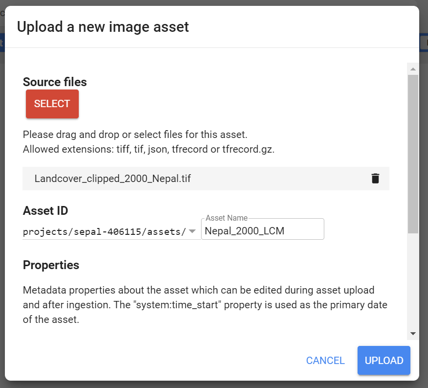

3. Repeat step 2 for each of the land cover maps.

Creating an Image Collection
~~~~~~~~~~~~~~~~~~~~~~~~~~~~

An Image Collection is a stack or sequence of images.Once all the land cover maps have been successfuly uploaded,we now need to create an image collection for the images to be usable in computation as explained earlier.
To create an Image Collection;

1. Click on the **Assets Tab** and then New > **Image collection.**

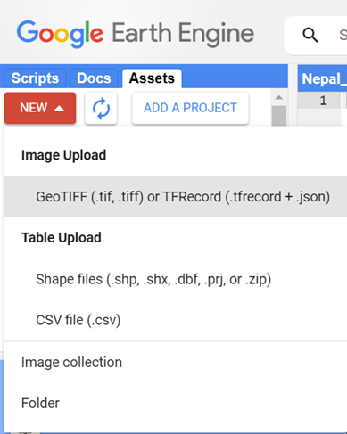

2. This will open the image collection constructor that will first prompt you to name your image collection as shown below:

.. image:: ../_static/sepal/naming_image_collection.png
   :align: center
   :width: 400
   :alt: Naming Image-collection

3. Once the image collection is created, you can load it by pasting an Earth Engine asset ID into the Image Collection constructor (Ensure the **Edit** button is on) or by simply dragging the individual assets to the image collection in the assets list as shown below:

.. image:: ../_static/sepal/naming_image_collection.png
   :align: center
   :width: 700
   :alt: Creating Image-collection

4. Repeat this for each asset. Clicking on the Image Collection(in the asset list) should now show all the images that are contained in that collection and should now be ready to be used in your analysis or visualization.
 
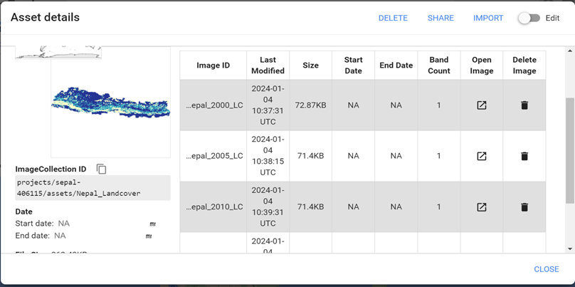

Uploading  Table files
~~~~~~~~~~~~~~~~~~~~~~
Tabular data can be uploaded into Google Earth Engine as comma-separated values (CSV) or Javascript Object Notation(JSON) files :code:`.csv`, or :code:`.json`). To upload a tabular files do the following:

1. Select New > **csv file upload**. 
2. In the pop-up window that appears, select the file you want to upload from your computer 

.. image:: C:/Users/Rotich/DOCUMENTATION/SEPAL/Media/sepal_corrections/uploading_csv.PNG
   :align: center
   :width: 400
   :alt: Geotiff_upload

.. tip::
   Now that all your files are uploaded in GEE, you can now access and use your assets in SEPAL. As you have already established a connection between your GEE and SEPAL accounts, all your assets are synced and available for you in SEPAL. You will be able to select them from the dropdown or copy/paste them directly from GEE when prompted in SEPAL-SDG 15.4.2 :sub:`beta`

.. _Vector_File_Manager:

Uploading vector files into SEPAL via the Vector File Manager.
~~~~~~~~~~~~~~~~~~~~~~~~~~~~~~~~~~~~~~~~~~~~~~~~~~~~~~~~~~~~~~

Apart from Google Earth Engine,you can directly upload your tabular datasets ( vector or CSV tables) into the SEPAL environment through the Vector File Manager.Read more on the `Vector File Manager here <https://docs.sepal.io/en/latest/modules/dwn/vector_manager.html>`_.

1. Navigate to the **Apps** tab (located on the left of the SEPAL interface) and find the **Vector File Manager** by either navigating through the app list or using the search bar.
2. Clicking on the app opens the vector file manager as shown below:
   
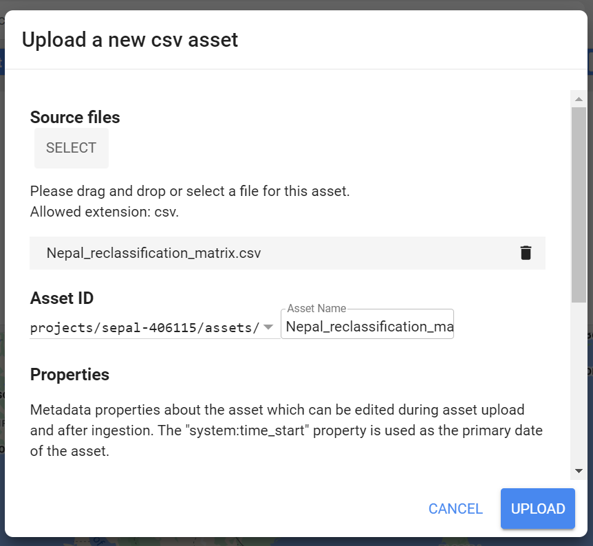

3. Clicking on the drop down arrow allows you to select the table type.(Accepted formats are shapefiles :code:`.shp` and table file :code:`.csv`)
4. Choose the shapefile option and click on the :code:`📎` icon to navigate to your files and choose all appropriate files and click :guilabel:`Import`.

5. The vector file manager notifies you when the importation is complete and shows its location as follows:
   
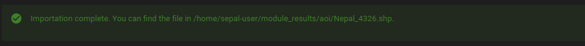

6. To locate the file you just uploaded into SEPAL, Click on the Module_Results > AOI in the Home page:
   
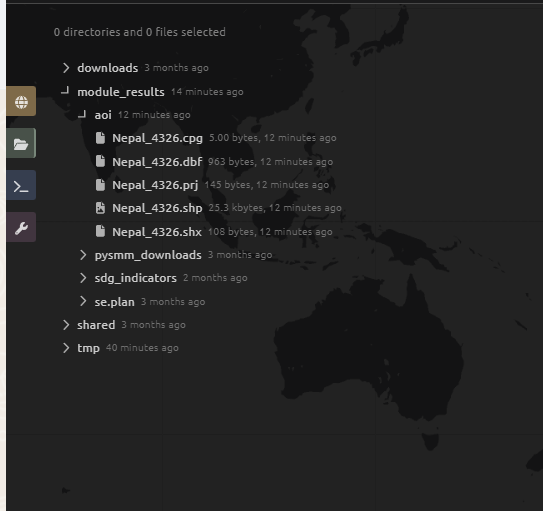

The vector files you just uploaded are now within the SEPAL environment and can be used when required.

.. seealso:: The methods are explained above should suffice for our case. However,since SEPAL’s built-in tools for uploading and downloading are limited, large amounts of data should be uploaded or downloaded using an FTP solution.More on this can be found `here <https://docs.sepal.io/en/latest/setup/filezilla.html#>`_.

The SEPAL interface and the SEPAL-SDG 15.4.2 :sub:`beta` module
---------------------------------------------------------------

New SEPAL users are recommended to look over the interface and familiarize themselves with the SEPAL interface, main tools,functionalities and workflows. A detailed description of the features can be consulted in the `SEPAL documentation <https://docs.sepal.io/en/latest/setup/presentation.html#sepal-interface>`_.

Setting up a SEPAL instance
^^^^^^^^^^^^^^^^^^^^^^^^^^^
SEPAL-applications such as the SEPAL-SDG 15.4.2 :sub:`beta` make use of instances (computational/processing units); running them will use your SEPAL computing resources.

Selecting an app automatically initiates the smallest instance to run the SEPAL sandbox. However, in some cases, especially where more powerful processing is required, you might need larger instances. For this reason, you may need to manually set up a larger SEPAL instance before running SEPAL-SDG 15.4.2 :sub:`beta`. To manually set-up an instance;

1. Go to the `SEPAL terminal <https://docs.sepal.io/en/latest/setup/presentation.html#terminal>`_ (blue icon in the left panel in the image below) and wait for the instance selector to start.

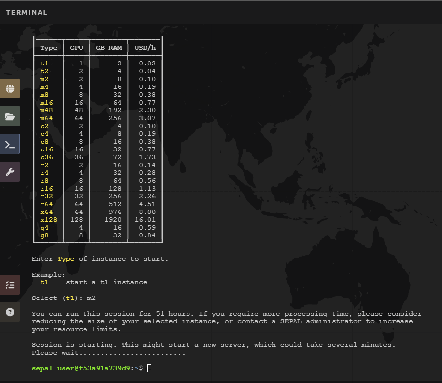

2. Type the instance name (In our case **m2** or **m4** should suffice), then press **ENTER**.
3. Wait for the instance to finish loading.
4. Once completed, go back to the dashboard of the application and launch your app, this will automatically use the instance you have set.

Accessing SEPAL-SDG 15.4.2 :sub:`beta`
^^^^^^^^^^^^^^^^^^^^^^^^^^^^^^^^^^^^^^^

To access the the SEPAL-SDG 15.4.2 :sub:`beta` module use the `apps tab <https://docs.sepal.io/en/latest/setup/presentation.html#apps-tab>`_ and navigate through the list of apps until you find the module (alternatively, you can type in the search box "SEPAL-SDG 15.4.2"). Once you have found it, click over the app drawer and wait patiently until SEPAL-SDG 15.4.2 :sub:`beta` module is displayed (it may take a few minutes). 

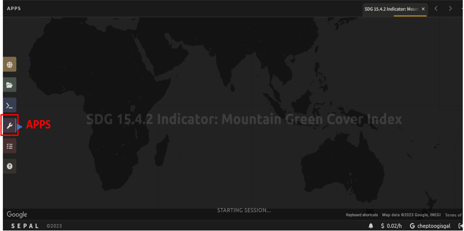

The module should look like the image below. As with any other SEPAL module, SEPAL-SDG 15.4.2 :sub:`beta` is divided into two main sections:

- **Process drawers**: Located on the top left of the interface,this is where you find the processing steps to accomplish the goal of the module. In SEPAL-SDG 15.4.2 :sub:`beta`, this is composed by 4 processing steps: Area of Interest; Land Cover Settings; Indicator Settings and Results.

- **Help drawers**: Located just below the process drawers,the help drawers describes the tool, its objectives and gives a background on its development. In SEPAL-SDG 15.4.2 :sub:`beta`,its composed of the source code (the module was developed under a MIT license, which means that the development is freely accessible, and the code is public in GitHub); the Wiki (the latest documentation on the tool) and the Bug report (use this section to report any unexpected results or behavior. To do so, please follow the `contribution guidelines <https://github.com/dfguerrerom/sepal_mgci/blob/master/CONTRIBUTE.md>`_.)

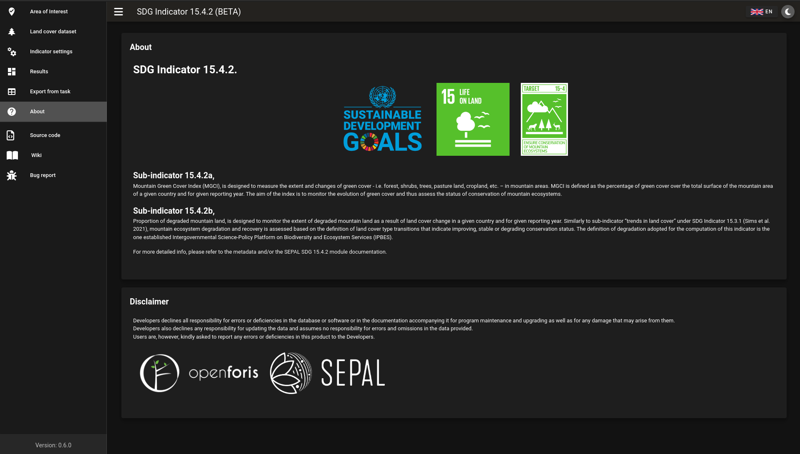

Personalising SEPAL-SDG 15.4.2 :sub:`beta`
^^^^^^^^^^^^^^^^^^^^^^^^^^^^^^^^^^^^^^^^^^

SEPAL includes functionalities for users to personalize the appearance of the module to their liking.

**Theme customization:**

SEPAL SDG 14.4.2 :sub:`beta` allows users to choose between a dark or light theme. To change the theme, click the light mode/dark mode icon (highlighted) at the top ribbon of the interface. The application will need to be restarted to apply the changes.

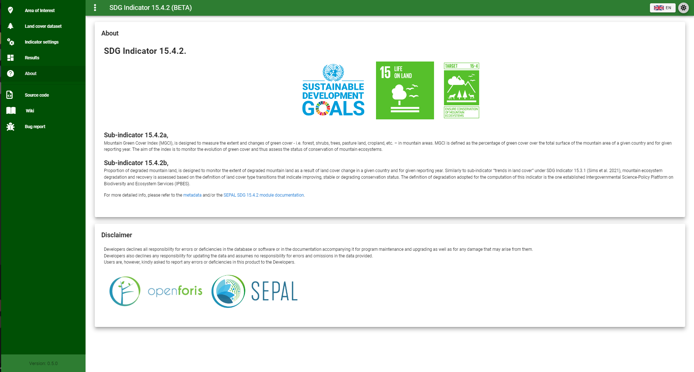

**Language selection:**

SEPAL-SDG 15.4.2 :sub:`beta` is currently only available in English. New language versions will be made available soon. 

Calculating SDG Indicator 15.4.2
--------------------------------

Conceptual Framework
^^^^^^^^^^^^^^^^^^^^
This section will guide you through the sequence of processing steps to calculate SDG indicator 15.4.2.

Our main goal is to assess the changes in land cover in mountain areas by bioclimatic belts. The algorithm works using land cover data, a digital elevation model, a mountain area map and a national administrative boundary layer.

Overview of Sub-Indicator 15.4.2 :sub:`a`: (Mountain Green Cover Index)
^^^^^^^^^^^^^^^^^^^^^^^^^^^^^^^^^^^^^^^^^^^^^^^^^^^^^^^^^^^^^^^^^^^^^^^

**Sub-indicator 15.4.2a: Mountain Green Cover Index (MGCI)**, is designed to measure the extent and changes of green cover - i.e. forest, shrubs, trees, pasture land, cropland, etc. – in mountain areas. MGCI is defined as the percentage of green cover over the total surface of the mountain area of a given country and for given reporting year.

The aim of the index is to monitor the evolution of the green cover and thus assess the status of conservation of mountain ecosystems and is defined as follows:

.. math::
    
    MGCI = (Mountain Green Cover Area n)/(Total Mountain Area)

Where: 

- **Mountain Green Cover Area n** = Sum of areas (in km :sup:`2`) covered by (1) tree-covered areas, (2) croplands,(3) grasslands, (4) shrub-covered areas and (5) shrubs and/or herbaceous vegetation, aquatic or regularly flooded classes in the reporting period *n*
- **Total mountain area** = Total area of mountains (in km :sup:`2`). (In both the numerator and denominator, mountain area is defined according to UNEP-WCMC (2002).)

Overview of Sub-Indicator 15.4.2b (Proportion of Degraded Mountain Land)
^^^^^^^^^^^^^^^^^^^^^^^^^^^^^^^^^^^^^^^^^^^^^^^^^^^^^^^^^^^^^^^^^^^^^^^^

**Sub-indicator 15.4.2b, Proportion Degraded Mountain Land**, is designed to monitor the extent of degraded mountain land as a result of land cover change of a given country and for given reporting year. Similarly to sub-indicator ‘’trends in land cover” under SDG Indicator 15.3.1 (Sims et al. 2021), mountain ecosystem degradation and recovery is assessed based on the definition of land cover type transitions that constitute degradation, as either improving, stable or degraded. The definition of degradation adopted for the computation of this indicator is the one established Intergovernmental Science-Policy Platform on Biodiversity and Ecosystem Services (IPBES).

.. math::

	Proportion of Degraded Mountain Land = (Degraded Mountain Area n) / (Total Mountain Area)* 100

Where:

- **Degraded mountain area** = Total degraded mountain area (in km :sup:`2`) in the reporting period *n*. This is, the sum of the areas where land cover change is considered to constitute degradation from the baseline period. Degraded mountain land will be assessed based on a land cover transition matrix in :ref:`Annex <Annex>`.
- **Total mountain area** = Total area of mountains (in km :sup:`2`). In both the numerator and denominator, mountain area is defined according to UNEP-WCMC (2002).

**Disaggregation:**

In the computation,sub-indicator 15.4.2a is disaggregated by the 10 SEEA classes based on UN Statistical Division (2014).Both of these sub-indicators are disaggregated by mountain bioclimatic belts as defined by Körner et al. (2011).  Those values are reported both as proportions (percent) and area (in square kilometres)

More detailed information on the overall conceptual framework of the indicator is available in the `indicator's metadata <https://unstats.un.org/sdgs/metadata/files/Metadata-15-04-02.pdf>`_.

Let’s us now  delve into the computation of SDG 15.4.2.We will do this step-by-step using the example of Nepal.

Computing SDG 15.4.2
--------------------
Defining the Area of Interest (AoI)
-----------------------------------

The calculation of the SDG 15.4.2 is restricted to a specific Area of Interest (AoI) defined by the user. In this first step, you will have the option to choose between the predefined list of administrative layers or to use a custom dataset. 

**1.	Click on the Area of Interest Drawer in the left panel menu to define your AoI.** 

A pop-up displays the available options to set your AoI,namely: 

- Administrative definitions
- Custom layers

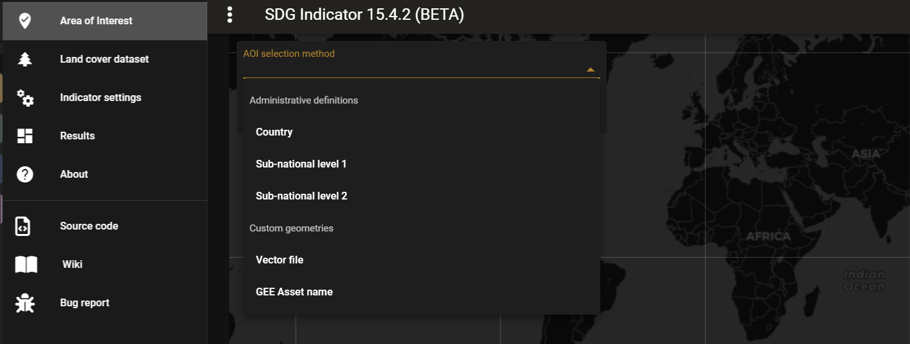

**Administrative Definitions**

**2.The Administrative definitions option uses the predifined administrative boundary layers available by default in the module.(FAO GAUL,2015),To define the Area of Interest using this option:**

- Select **Country** under AOI selection method.
- In the dropdown list that will appear, select the country or territory in which you want to calculate SDG Indicator 15.4.2. In this example, we will select Nepal, as shown below.

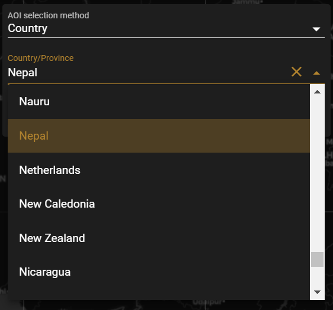

- Click on **Select Area of Interest (AOI)** and the map will display your selection. A corresponding legend is also displayed. The algorithm automatically generates a legend based on the mountain bioclimatic belt classes and the area for each of them as defined in the global mountain map developed by FAO to compute this indicator. 

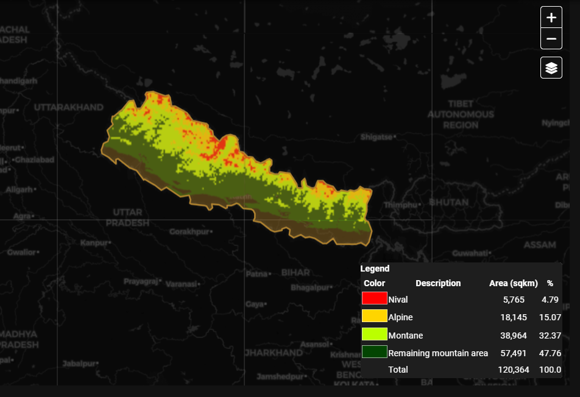

.. warning:: The  administrative boundaries available on SEPAL-SDG 15.4.2 :sub:`beta` are extracted from FAO GAUL (Global Administrative Unit Layers) 2015 data set. The designations employed and the presentation of material on this map do not imply the expression of any opinion whatsoever on the part of the Secretariat of the United Nations concerning the legal status of any country, territory, city or area or of its authorities, or concerning the delimitation of its frontiers or boundaries. 

**Custom geometries**

**3.The Custom layers option allow users to use their own national administrative boundary layers.** To define the Area of Interest using your own custom administrative boundary layer you have two options: use a vector file that you have previously uploaded in GEE as an asset (GEE asset name option), or use a vector file that you have previously uploaded in your SEPAL environment (Vector file option).

**Using a GEE asset ;**

- Choose **GEE Asset Name** as your AOI selection method.
- Copy the **Asset ID** in GEE and paste under "Select an asset"
- Specify the column or leave the "Use all features" option to leave the default settings.

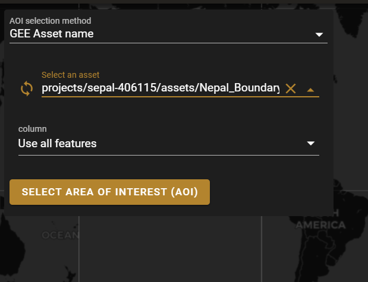

**Using a vector file;**

- Choose the **Vector File** under the Custom geometries as your AOI selection method.
- This will prompt you to choose your vector file (Remember the vector file must already be in the SEPAL environment).Check the :ref:`Uploading vector files using the vector file manager chapter <Vector_File_Manager>` to see how to see how that's done.
- Specify the column or leave the "Use all features" option and click :guilabel:`Select Area of Interest`

Land cover dataset 
------------------

Having defined the Area of Interest in the previous section,we are now going to stipulate which landcover data we are going to use in the analysis.

.. Note:: As mentioned earlier,users have an option of using national datasets or the default (ESA-CCI derived ones). If using custom land cover maps , you will also be requested to set up land cover legend reclassification rules for Sub-indicator A and B, as well as the land cover transition matrix for computing Sub-Indicator B.This will be described in detail in the following sections.

Defining your land cover dataset 
^^^^^^^^^^^^^^^^^^^^^^^^^^^^^^^^

**1.	Click on the Land cover dataset drawer in the left panel menu.** A pop-up questionnaire will ask you to indicate the land cover map you wish to use. 

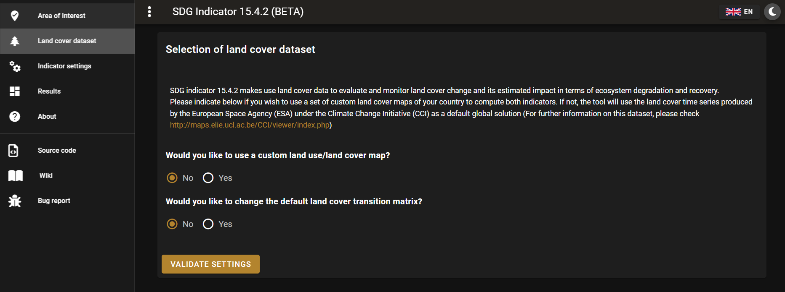

**2. In the first question of the questionnaire, you have to indicate the land cover maps that you wish to use to compute the indicator.**

If you want to use your own custom land cover datasets,select :guilabel:`yes`  to this question, a new button :guilabel:`Open Parameters Settings`  will appear. If you select :guilabel:`No` , the module will automatically use the default global land cover datasets for calculating this indicator (ESA CLI Landcover ). We will look at each scenario individually:

Using the Default Landcover Maps
~~~~~~~~~~~~~~~~~~~~~~~~~~~~~~~~

When custom national landcover maps are not available,national agencies can use the default landcover maps available in SEPAL SDG 14.4.2 :sub:`beta`.

After clicking on :guilabel:`No`  to the first question,you have a choice to modify the land cover transition matrix or use the default one.If using the default one, click :guilabel:`No`  to the transition matrix question and proceed to the :ref:`Defining the Indicator Settings Chapter<Indicator Settings>`

In the case where national agencies want to modify the landcover transition matrix,the process is described :ref:`here <Defaultlccustommatrix>`.

Using Custom Landcover maps
~~~~~~~~~~~~~~~~~~~~~~~~~~~
- Select :guilabel:`yes`  to the first question. Then click on :guilabel:`Open Parameters Settings`  as shown below:

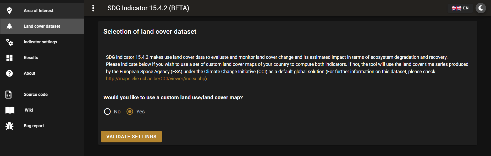

- This opens a new pop-up window that allows you to select your land cover maps as a GEE asset (remember that they must be stored as a `GEE image collection <https://developers.google.com/earth-engine/guides/ic_creating>`_ to be able to be imported.) Use the bottom arrow to choose your asset or copy/paste it directly from GEE. Then click on :guilabel:`Get classes`

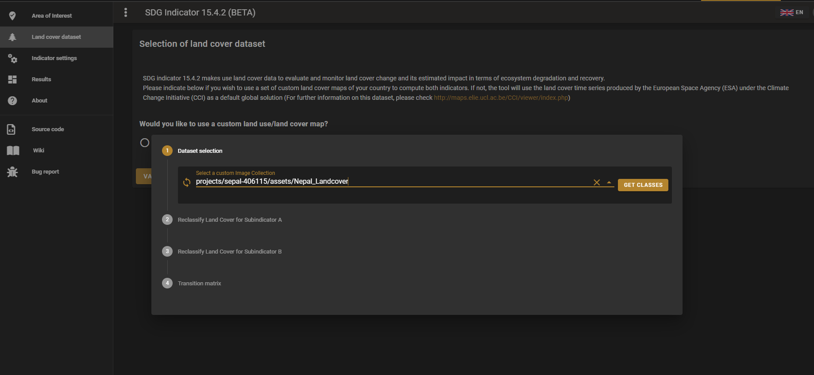

Reclassifying the landcover map legend for sub-Indicator A computation.
^^^^^^^^^^^^^^^^^^^^^^^^^^^^^^^^^^^^^^^^^^^^^^^^^^^^^^^^^^^^^^^^^^^^^^^^

- Once you have specified your custom image collection, you will be required to reclassify the legend of your land cover maps into the 10 landcover classes as defined by the UN-SEEA , which is,as explained earlier,the FAO-defined land cover legend for SDG 15.4.2 computation.

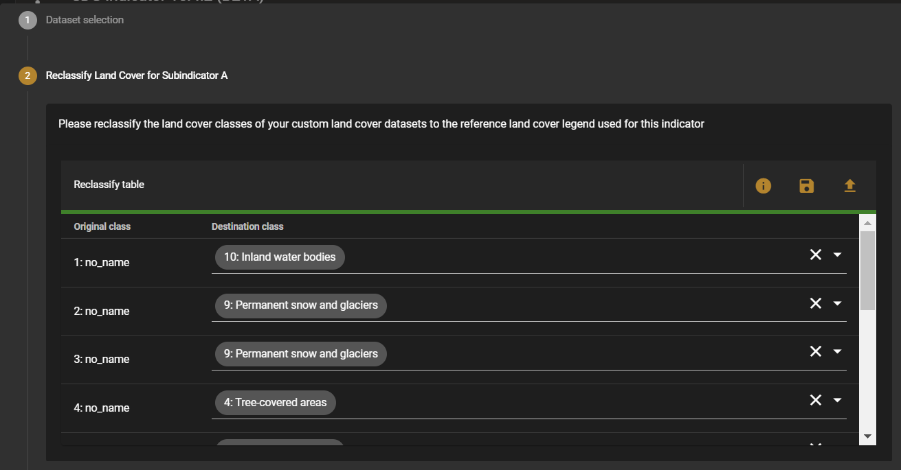

Reclassification can be done in two different ways; By manually reclassifying your source and target landclasses or by uploading a reclassification matrix.

Using a reclassification matrix
~~~~~~~~~~~~~~~~~~~~~~~~~~~~~~~~

.. _reclass_table:
  .. tip::
   
     What is a reclassification matrix table?

     A reclassification matrix is a comma-separated values (CSV) file used to reclassify old pixel values into new ones. The CSV file only has to contain two values per line, the first one refers to the `from` value, while the second is the `target` value, just as it is described in the following table: 

      .. csv-table:: Reclassification table example
         :header: "Origin class", "Target class"
         :widths: auto
         :align: center

         "311", "1"
         "111", "5"
         "...","..."
         "511", "4"

- To upload a reclassification table,click on the arrow icon :guilabel:`⬆`  located in the top right corner of the reclassification pop-up window(see the image above).
- Upload a reclassification matrix table in :code:`.CSV` format, indicating the SEEA land cover equivalent of the classes of your land cover map.Remember the table must already be uploaded in your SEPAL environment. To learn how to do that, please see the `how to exchange files in SEPAL <https://docs.sepal.io/en/latest/setup/filezilla.html#exchange-files-with-sepal>`_. 

.. tip:: The target values must match the UN-SEAA classes codes for sub-indicator A (click on the info button at the top of the table for information on how the SEEA classes are coded).

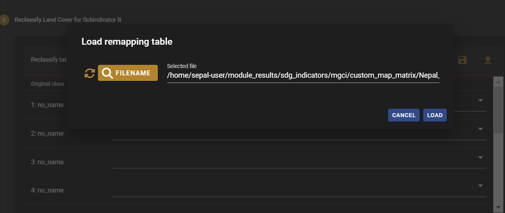

- Clicking on :guilabel:`load` will automatically reclassify your landcover legend into the legend defined by the reclassification matrix.
- **In certain cases, landcover classes might be classified as No Data,Missing Values or Unclassified.In such cases leaving the classes blank will be interpreted as O values by SEPAL SDG 15.4.2 :sub:`beta` and consequently not included in the computation. Note: Any values left blank will be interpreted as 0.**

.. Important:: For ease and comparability in defining the reclassifiaction matrix,the development team have created a CSV template that countries can download and modify for their use.You can also find the template in the :ref:`Annex section <Annex>`.Remember you have to upload the CSV file into SEPAL for you to use it.

Manual Reclassification 
~~~~~~~~~~~~~~~~~~~~~~~~
- Directly specify the reclassification rules by manually indicating the SEEA land cover equivalent (in the destination class column) of each of the land cover classes of your land cover map (in the original class column) as shown below:If need be,the information icon located at the tools ribbon(upper right hand can be used to refer to the UN-SEAA classes )
- After manually reclassifying your legend, you can use the save :guilabel:`💾` button located at the top of the table to save hte table as a CSV file, that can be used at a  future calculation instead of manually filling up the table again.

In our example, we will reclassify Nepal’s national land cover class using the following guide:

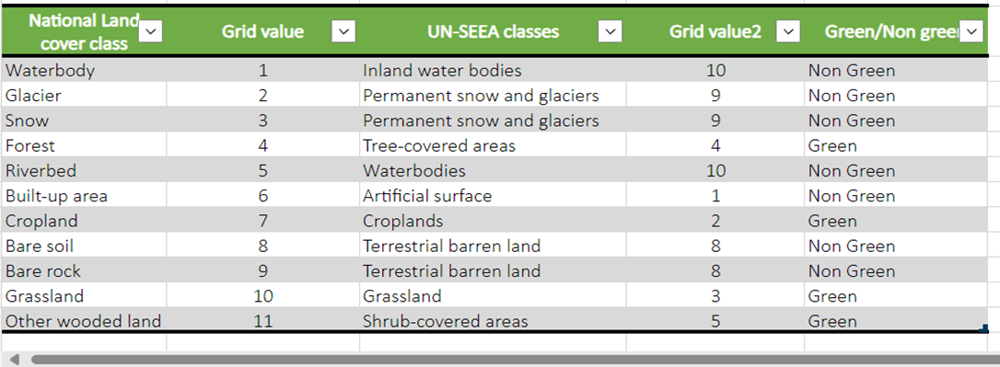

- Once you have reclassified all the land classes for Sub-Indicator A, click on "Reclassify Land Cover for Sub-Indicator B"

Reclassifying your landcover map legend for sub-Indicator B computation.
^^^^^^^^^^^^^^^^^^^^^^^^^^^^^^^^^^^^^^^^^^^^^^^^^^^^^^^^^^^^^^^^^^^^^^^^
This step allows you to reclassify the legend of your land cover map for computing Sub-Indicator B. 

.. Note:: In contrast to Sub-Indicator A, the land cover legend used for the calculation of Sub-Indicator B does not necessarily have to be the 10 UN-SEEA classes. In this sub-indicator, the UN-SEEA legend can be adapted to the national context to ensure that it adequately captures the key degradation and improvement transitions identified in the prior step. For instance, a given country may decide to differentiate "natural forests" from "tree plantations" in sub-indicator B. 

For this reason, this step allows users to apply a new reclassification, or alternatively, use the same reclassification rules defined in Sub-Indicator A. In the latter case,you can access the the reclassification matrix you created and saved earlier by clicking the upload button amnd choosing the file. For both cases, the land cover reclassification rules must be a :code:`.CSV` file, following the same method as in the prior step.

Check the :ref:`Annex <Annex>` for the template that can be modified for your landcover legend.

Uploading a transition matrix for computing Sub-Indicator B
^^^^^^^^^^^^^^^^^^^^^^^^^^^^^^^^^^^^^^^^^^^^^^^^^^^^^^^^^^^

.. important:: **This step should only be completed if you have provided different land cover reclassification rules for Sub-Indicator B in the prior step.** 

The next step is to upload a land cover transition matrix, defining the transitions between the land cover classes.We will consider the transitions to be either **degraded** , **stable** or **improved** , consistent to the legend you have provided in the prior step. This will allow SEPAL-SDG 15.4.2 :sub:`beta` to compute this sub-indicator in the next processing steps. 

Here again the transition matrix should have been previously uploaded in your SEPAL environment as a :code:`.CSV` file.Remember the transition matrix must include the following columns: from_code, to_code,from_name,to_name,impact_name and impact_code (indication of change between the land cover classes)

Check the :ref:`Annex <Annex>` for the  transition matrix template.

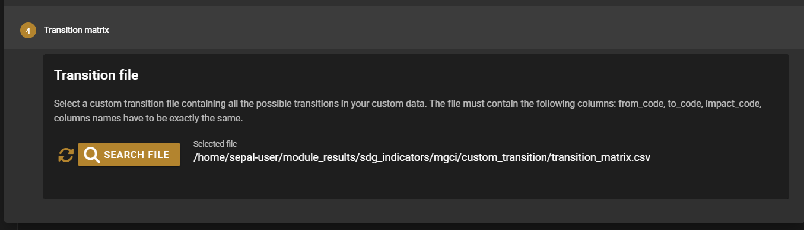

.. _Defaultlccustommatrix:

Changing the default land cover transition matrix for computing Sub-Indicator B using the default global land cover data
^^^^^^^^^^^^^^^^^^^^^^^^^^^^^^^^^^^^^^^^^^^^^^^^^^^^^^^^^^^^^^^^^^^^^^^^^^^^^^^^^^^^^^^^^^^^^^^^^^^^^^^^^^^^^^^^^^^^^^^^

As explained earlier,SEPAL-SDG 15.4.2 :sub:`beta` gives the users liberty to modify the land cover transition matrix even when the default landcover maps have been used. This capability allows national authorities to adapt the transition matrix to to their local context and consequently capture the main land degradation processes occurring in the country without needing to provide alternative land cover data.

This can be done selecting :guilabel:`Yes` to the second question of the land cover dataset questionnaire, and then clicking on :guilabel:`Open Parameter Settings`.

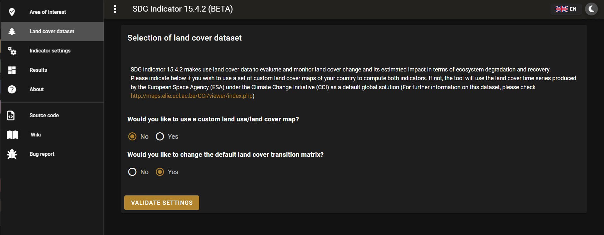

This will open a pop-up window including the default land cover transitions matrix, showing positive land cover transitions in green, negative in red, and stable/neutral transitions in blue. The matrix can be directly modified by clicking on each cell and changing the sign of the transition.

.. image:: ../_static/sepal/transition_matrix_modify.PNG
   :align: center
   :width: 900
   :alt: Reclassify table

Once finished, just click outside the window and move to the next processing step: **Indicators Settings.**

.. warning::

   Adapting the default land cover transition matrix using the default global land cover data should be carefully considered. Decisions about which land cover transitions are linked to a degradation or an improvement process in the context of sub-indicator B should be made taking into account the expected change in biodiversity and the mountain ecosystem functions or services that are considered desirable in a local or national context. For these reasons, FAO recommends to consider as degradation all land cover transitions that involve changes from natural land cover types (such as forests, shrublands, grasslands, wetlands) to anthropogenic land cover types (artificial surfaces, cropland, pastures, plantation forests, etc.) as a general rule, given that land use change is known to be the primary driver of biodiversity loss (IPBES, 2019).

.. _Indicator Settings:

Indicators Settings
-------------------

Now that we have defined our area of interest and the land cover data to be used in the analysis, together with the land cover legend reclassification rules and associated transitions , click on the **Indicator Settings drawer** to set the parameters that the tool will base the computation on.

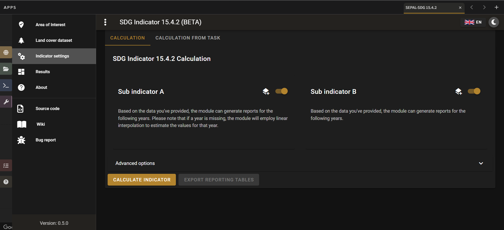

From here on, let’s tackle the sub-indicators individually.

Defining parameters for Sub-indicator A: Mountain Green Cover Index
^^^^^^^^^^^^^^^^^^^^^^^^^^^^^^^^^^^^^^^^^^^^^^^^^^^^^^^^^^^^^^^^^^^

**1. Click on the add layer icon (highlighted below) to define the years for which the indicator will be calculated**

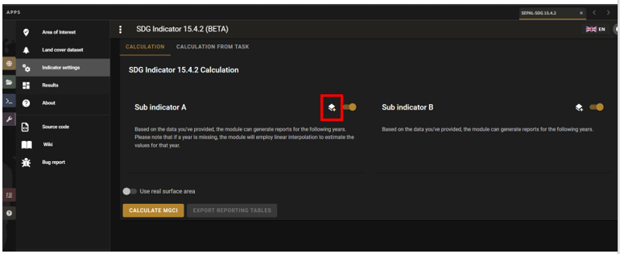

**2. In the pop-up window that will appear you need to link each of the land maps (either the default ones or the custom ones that you may have uploaded in the prior steps) to the corresponding reference year of each map. You can report one or multiple years. To increase the number of years to be reported, just click on the + sign to define additional years that you need to report.** 

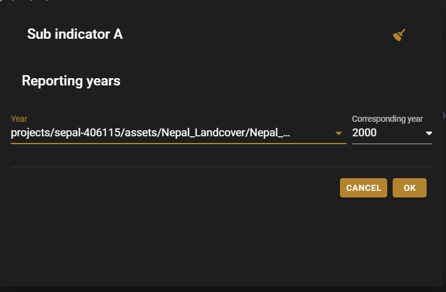

.. note:: Remember that reporting years for Sub-indicator A are **2000, 2005, 2010, 2015 and subsequently every 3 years (2018, 2021, 2024,...).** If you are using custom national land cover maps that are not annually updated and does not exactly match reporting years (for example, you may have a land cover map for 2004 instead of 2005), the tool will automatically interpolate values for the reporting years based on the years for which land cover data is available. 

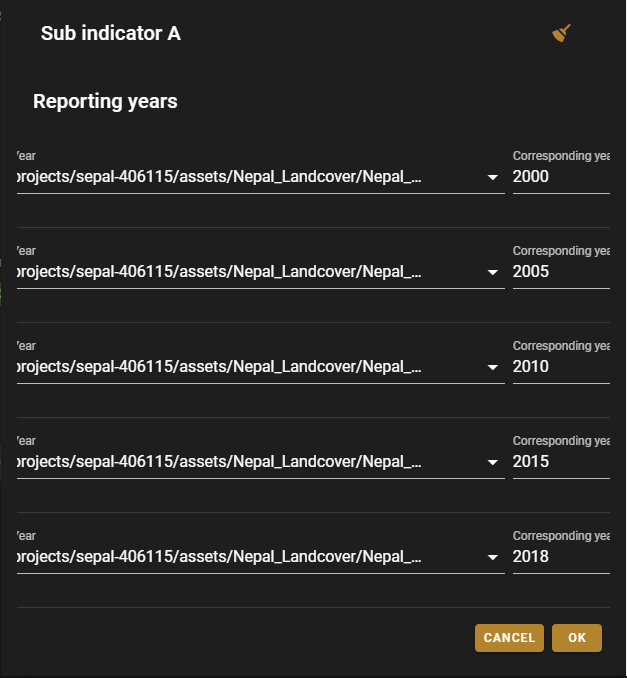

**3.	When finished, press OK. The list of reporting years will now be listed at the bottom of the Sub-Indicator A box.**

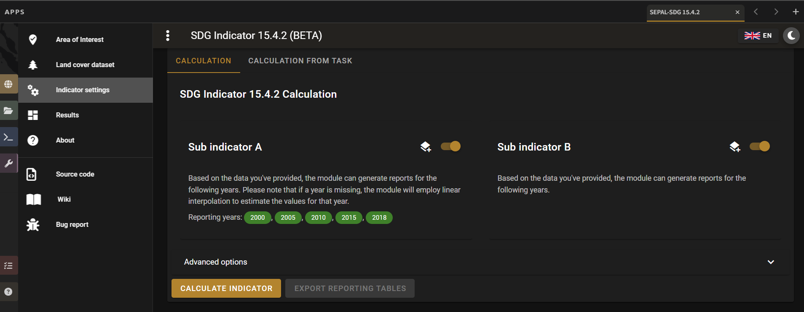

**4. SEPAL SDG 15.4.2 :sub:`beta` offers the following advanced options:**

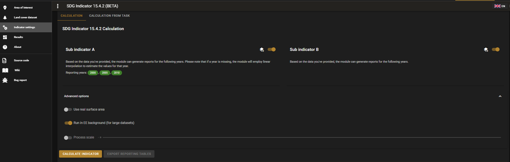

- Using Real Surface Area methods instead of Planimetric options used by default by SEPAL SDG 15.4.2 :sub:`beta`.(For more on this check the indicator's metadata )
- Running in GEE for large datasets(large datasets are automatically thrown into GEE for computation).This option should be chosen when there are computational time errors(usually associated with large datasets hence cannot be run on the fly).
- Process scale:If this capability is activated,allows the user to define the computational scale. Remember,the scale chosen will affect the speed of computation( finer scales will take more time and vice versa) and the accuracy of the results.If this option is not chosen,computation will run at the scale of the input data.
  

Defining parameters for Sub-Indicator B: Proportion of Degraded Mountain Land.
^^^^^^^^^^^^^^^^^^^^^^^^^^^^^^^^^^^^^^^^^^^^^^^^^^^^^^^^^^^^^^^^^^^^^^^^^^^^^^
In contrast to Sub-Indicator A, in Sub-Indicator B the extent of degraded mountain land is calculated first in the baseline period 2000 - 2015. This baseline sets the benchmark ​from which the extent of land degradation is measured and monitored i.e. every 3 years after 2015. Put simply, new land cover degradation in the reporting periods (2018, 2021, 2024, ...) is added to the baseline to estimate the current extent of land cover degradation.  This is why in this instance the tool automatically uses the 2000-2015 as baseline.

**1. Define your landcover maps for the baseline years (2000 and 2015) by linking each of the land maps to the corresponding reference year of each map. If you are using custom national land cover maps that does not exactely match reporting years of the baseline, select the map whose reference year is closest to the reporting year (For example, you could select a land cover map for 1998 for the reporting year 2000).**

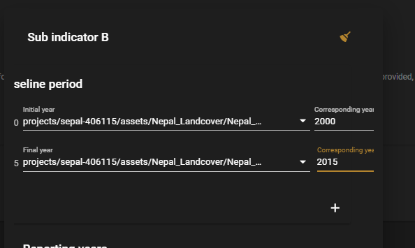

**2. Then define the land cover maps for each of the reporting years and click OK**

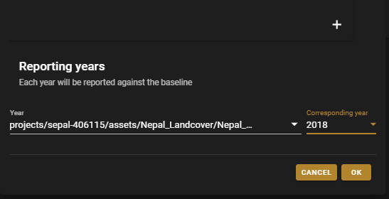

Calculation of SDG Indicator 15.4.2
-----------------------------------

Once you have set the parameters of each sub-indicator, the tool is now ready to compute the sub-indicators as shown below:

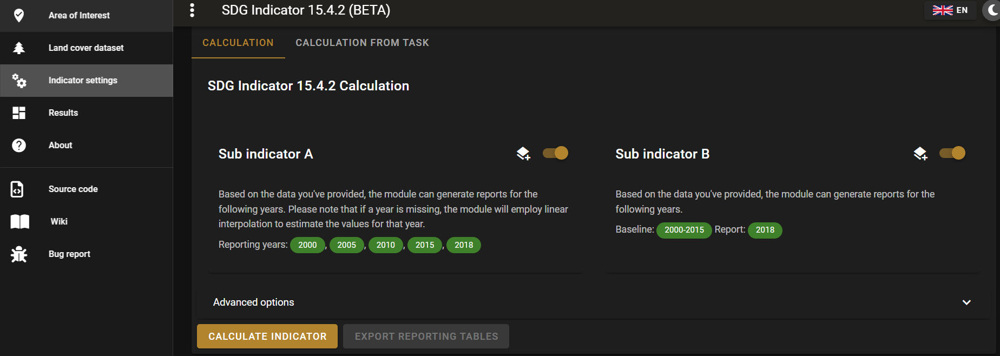

1. Click on the :guilabel:`Calculate MGCI`  to initiate the computation.

2. Once computation is completed, you should see a resemblance of the image below:

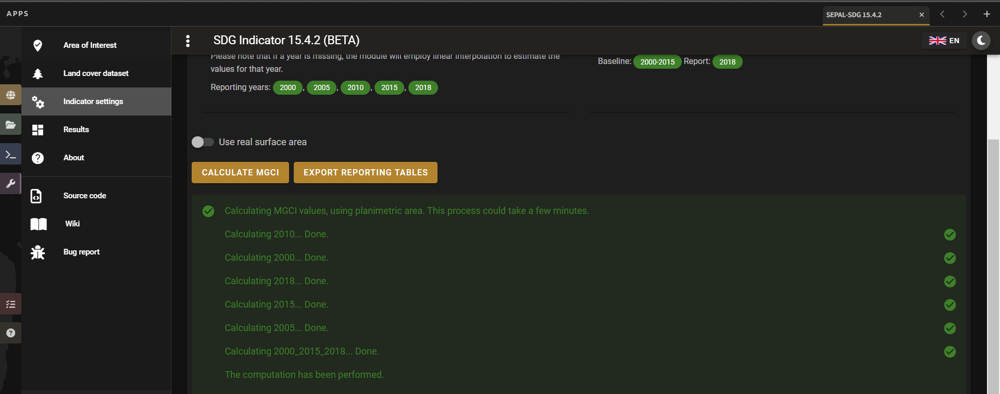

.. tip::

   SEPAL-SDG 15.4.2 :sub:`beta` calculates the indicator values assuming planimetric area methods by default. To calculate indicator values using the real surface area method (a method that takes into account the third dimension of mountain surfaces through the use of digital elevation models and is known to derive closer estimates of the real surface area of mountain regions), click on **Use Real Surface Area**

3. The entire computataion is done "on the fly” and thus you need to export your reporting tables to visualize and use them as and if required. To do that, click on  the :guilabel:`Export Reporting Tables`.  When completed, a message will appear indicating where the tables have been exported. 

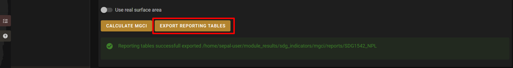

Calculation from Task
^^^^^^^^^^^^^^^^^^^^^
As explained in the previous sections, SEPAL runs on the Google Earth Interface. This means that the computation is restricted by available GEE resources. One limitation,however, is the time allowable to get results on the fly (see `computation time out <https://developers.google.com/earth-engine/guides/debugging#timed-out>`_). So any computation that takes more than five minutes will automatically throw an exception. To overcome this limitation, the process will be executed as a task —which are operations that are capable of running much longer than the standard timeout.Simply put, the computation is redirected to run on  GEE as opposed to the module. If the computation is created as a task, you will see a similar message as the shown in the image below:

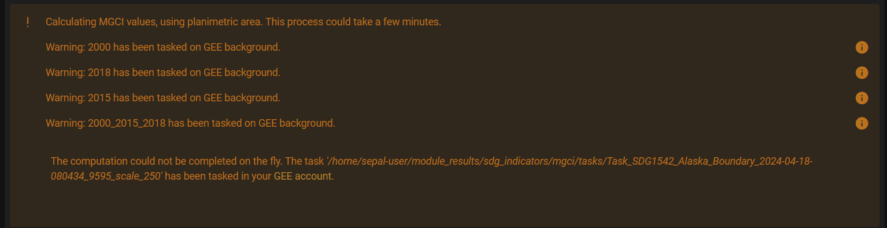

The computation in GEE can be seen running under the GEE tasks as shown here:

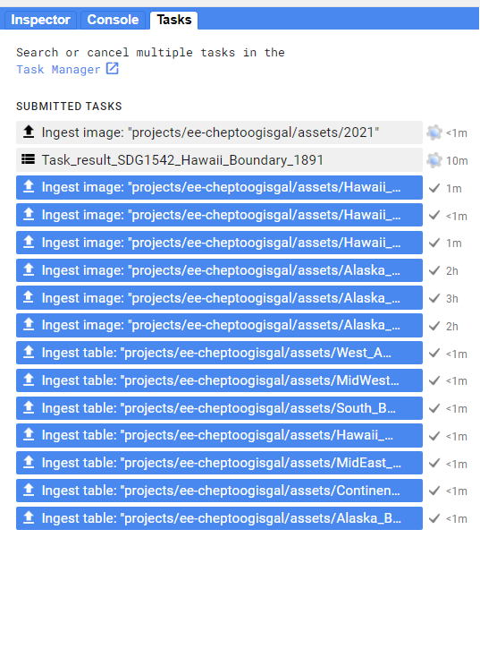

When computation can’t be done on the fly, a new file containing the id of the task is created and stored in the **../module_results/sdg_indicators/mgci/tasks** folder. This file will help you to track the status of the task at any moment. An alternative way to track the progress of the task is by using the GEE task tracker as shown above- there you can find the tasks that are running on the server.
Once the computation is complete in GEE,we will return to SEPAL-SDG 15.4.2 :sub:`beta` to continue with the rest of the computation.

Click on the **Export from Tasks** drawer on the left menu panel. This window highlights the steps to process GEE tasks as seen below:

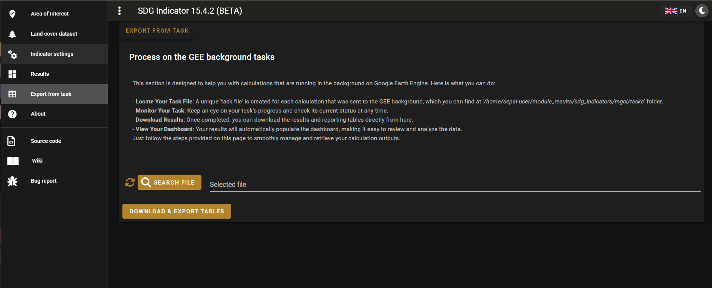

**1. To enable a computation from task; first we need to locate the tasks file within SEPAL.**

To do so, you can either search for a :code:`.JSON` task file in your SEPAL environment using the navigator by clicking on the search file button, and then clicking over the :guilabel:`Download Reporting Tables` button and the result will be displayed if the process status is completed .

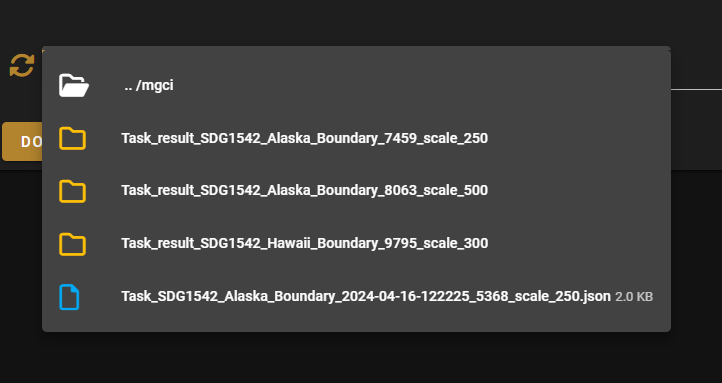

**2. Alternatively,you can locate the tasks manually by navigating to the **File Layer > Downloads > Module results>Tasks** on SEPAL as shown below:

.. image:: C:/Users/Rotich/DOCUMENTATION/SEPAL/Media/sepal_corrections/locating_tasks.png
   :align: center
   :width: 900
   :alt: Task File Location

**3. Clicking on the Download and Export Tables will finalize the computation**

Visualizing the results
-----------------------

SEPAL SDG 15.4.2 :sub:`beta` allows the visualization of the results in the following two ways: 

• **Using the exported tables**: These provide the full results of the computation in a tabular format.

• **Using the MGCI results drawer**: provides a simplified and visual representation of the results.

Let’s look at these individually;

Visualizing the results using the Exporting tables
^^^^^^^^^^^^^^^^^^^^^^^^^^^^^^^^^^^^^^^^^^^^^^^^^^

As explained earlier, once computation is completed, users can export the reporting tables from their SEPAL environment.

**1. To locate the tables, navigate to the Files Tab > Under the Downloads, you should see your table under MGCI reports as shown below:**

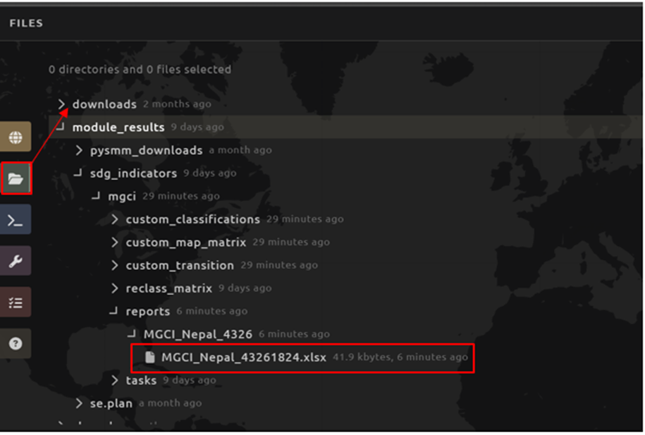

**2. To download the report from SEPAL, click on the report; this activates the download icon in the top right side of the screen.**

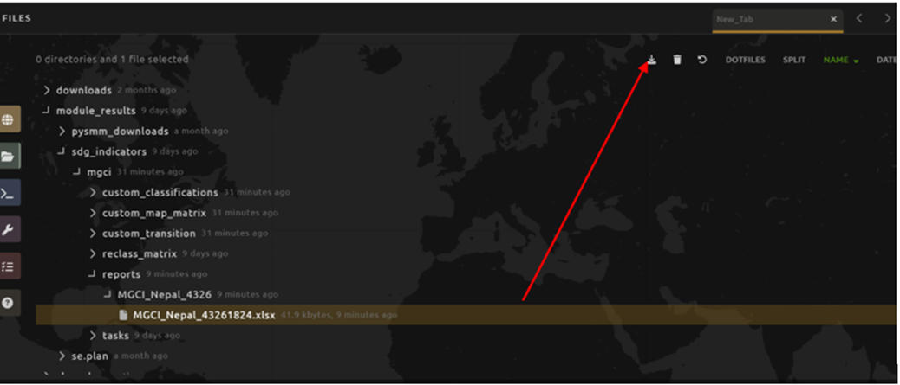

**3. Once the report is downloaded, you can visualize the results of the computation as seen below for all the reporting years defined earlier on.**

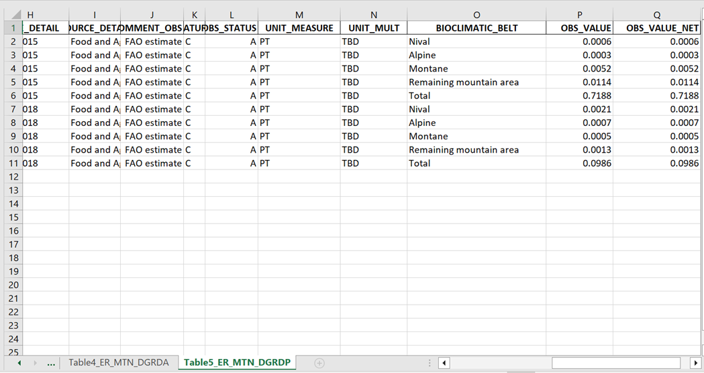

.. Tip:: The tables follow the standard format for SDG reporting and therefore can be used to report SDG Indicator 15.4.2 values to FAO.

Visualizing the results through the MGCI Results Drawer
^^^^^^^^^^^^^^^^^^^^^^^^^^^^^^^^^^^^^^^^^^^^^^^^^^^^^^^

SEPAL-SDG 15.4.2 :sub:`beta` also allows users to explore the results of the computation visually. The module generates dashboards and maps that show the changes that have occurred in the area of interest. To generate these, do the following;

**1.	Click on the MGCI results drawer** in the left panel as seen below:

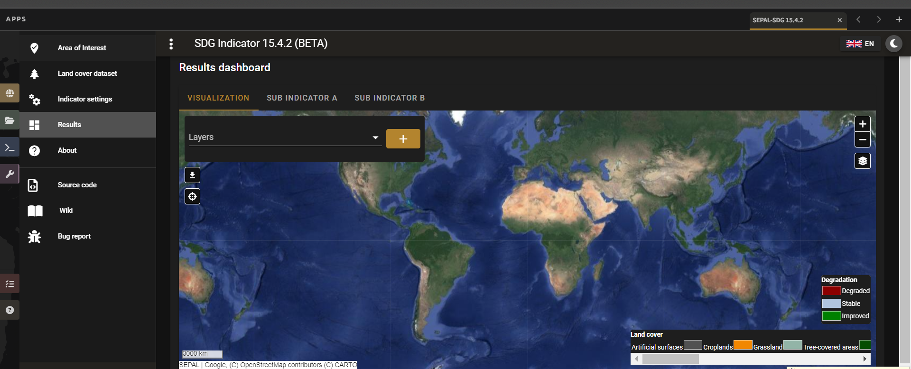

2. The **Visualization Tab**  on the top left of the Results dashboard generates a map of your AoI. Click on the tab and choose a year to visualize in the drop down list and click **+** as seen below:

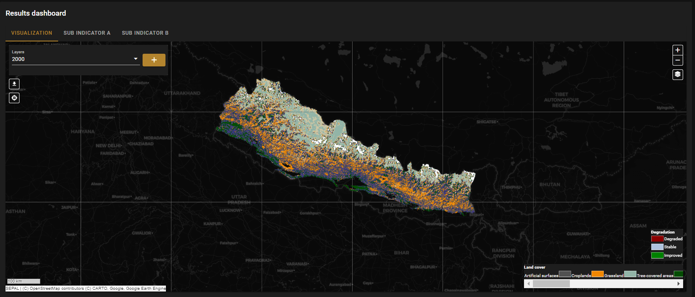

As seen above the map generated by the tool shows the landclasses and the degradation status for each of the years.

3. To generate the results from the computation for Sub-Indicator A, click on the **Sub-Indicator A tab** and choose the year you want to visualize and click on the :guilabel:`Calculate` button.This will generate dashboards to visualize the results of the computation. As seen below, the tool will generate an Overall MGCI for your study area. Additionally, dashboards will be generated for each of the bioclimatic classes.

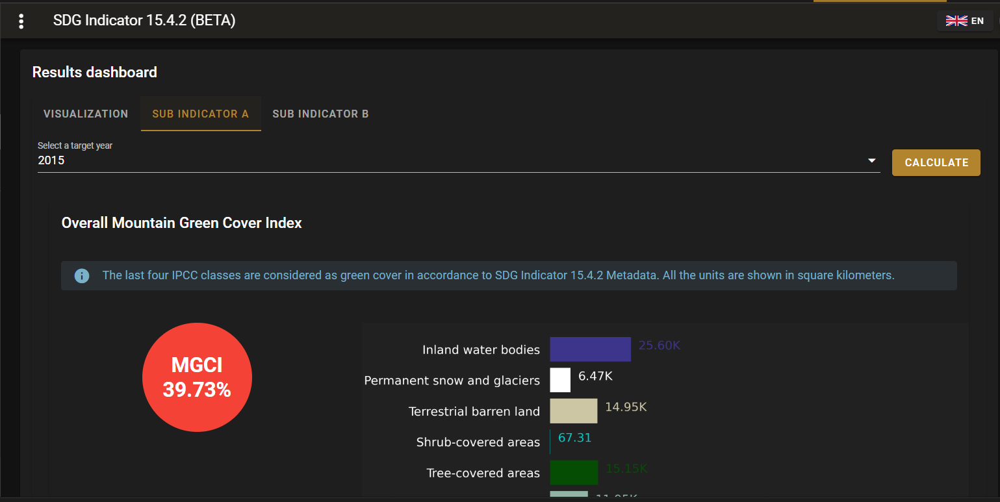

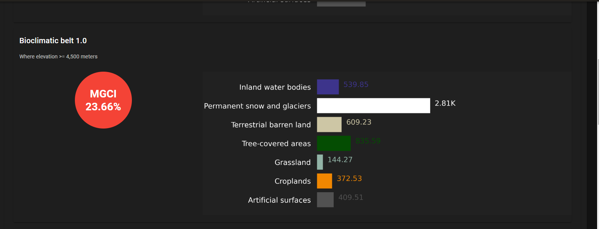

4. To see the results for Sub-Indicator B,click on the **Sub-Indicator B tab** and choose a target year (baseline or one of the reporting years) using the drop-down arrow and a bioclimatic belt. Then click on :guilabel:`Calculate` :

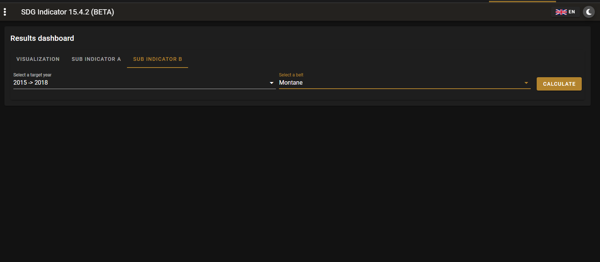

The results, shown as transitions in land cover types for a given belt will be displayed using a Sankey Plot, as shown below:

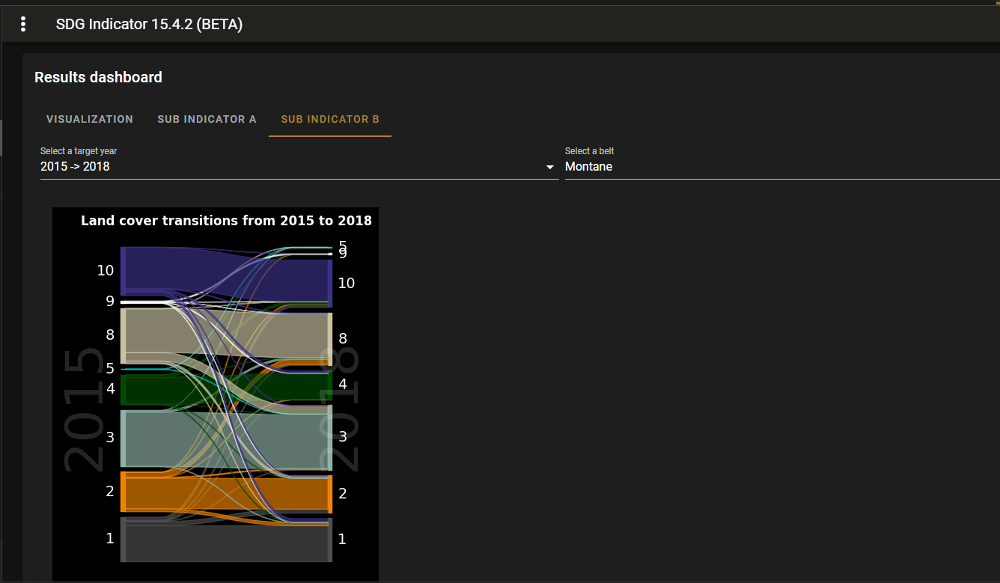

  
.. _Annex:

Annex
-----

This section contains supplementary information and resources for an enhanced understanding and operationalization of SEPAL-SDG 15.4.2 :sub:`beta`.

Computation resources:Template Tables
^^^^^^^^^^^^^^^^^^^^^^^^^^^^^^^^^^^^^

.. Tip:: All the templates contain a Readme section to guide users to populate the template.

Template A :Default Land Cover Map Reclassification Template.
~~~~~~~~~~~~~~~~~~~~~~~~~~~~~~~~~~~~~~~~~~~~~~~~~~~~~~~~~~~~~

In the computation of sub-indicator A using **custom** landcover maps,SEPAL SDG 15.4.2 :sub:`beta` calls for reclassifying the landcover legends into the UN-SEAA defined one.
The development team recommends countries to adopt this template to reclassify their land-cover maps .(It is important to note that the origin and target names and codes must be properly defined for the reclassification to work properly) 
The table structure calls users to have the following fields defined as columns:

- from_name: Associated name of each land cover class of the custom land cover map.
- from_code: Numerical code (pixel value) of each land cover class of the custom land cover map.

.. raw:: htm  
   <a href="../_static/sepal_tables/Custom_LC_Classification_SubB.csv" download="_static/sepal_tables/Custom_LC_Classification_SubB.csv">Custom_LC_Classification_SubB</a>

Template B: Custom LandCover Classification Template(Sub-indicator B) 
~~~~~~~~~~~~~~~~~~~~~~~~~~~~~~~~~~~~~~~~~~~~~~~~~~~~~~~~~~~~~~~~~~~~~

As explained earlier,countries must use the UN-SEAA defined classes in sub-indicator A but have more liberty when defining the classification scheme for sub-indicator B.
Countries can opt to use the UN-SEAA classification legend(defined in the earlier step) or use the FAO-defined template to develop their classification legehere

Download Template B 
h.. raw:: html

   <a href="../_static/sepal_tables/Default LC_map_reclassification.csv" download="_static/sepal_tables/Default LC_map_reclassification.csv">LC_map_reclassification</a
>ere:

Template C:Transition matrix
~~~~~~~~~~~~~~~~~~~~~~~~~~~~
This template is to be used when a custom land classification legend is used in Sub-Indicator B computation.It enables countries fully capture the transitions occurring in land-cover.
When adopting this template,remember to fully capture the original and resultant classes,the impact and their subsequent codes for the transition to be fully captured by SEPAL SDG 15.4.2 :sub:`
The following fields must be defined:

- from_name: Associated name of the original land cover class.
- from_code: Numerical code (pixel value) of the original land cover class.
- to_name: Associated name of the final land cover class.
- to_code: Numerical code (pixel value) of the final land cover class.
- impact_name: Expected impact of the land cover transition. Only 3 values are allowed: (degraded, stable, improved).
- impact_code : Associated code of the expected impact of the land cover transition. Only 3 values are allowed: (1 for degraded, 2 for stable, 3 for improved).

Download the template here:

.. raw:: html

   <a href="../_static/sepal_tables/Transition_Matrix_SubB.csv" download="_static/sepal_tables/Transition_Matrix_SubB.csv">Transition_Matrix_SubB</a>
b
.. note:: Remember that SEPAL SDG 15.4.2 :sub:`beta` only accepts :code:`.csv` files. Therefore,once all these tables are modified as per the countries'needs ,they should be made into :code:`.CSV` and imported into the SEPAL environment as described in earlier sections.
 here.

