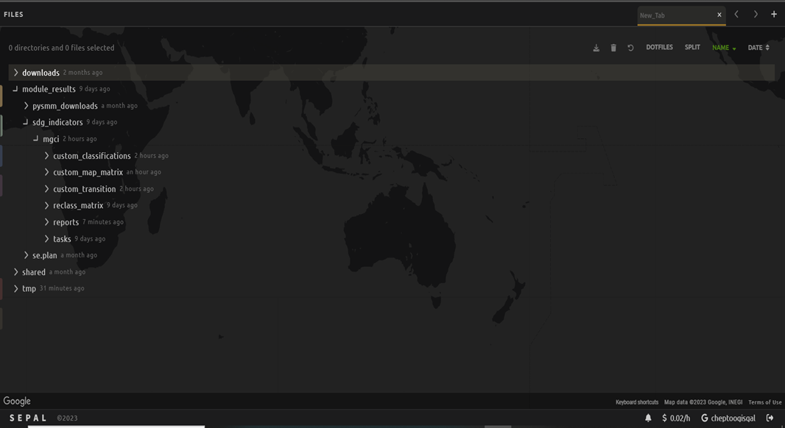

Module user interface
=====================

The SEPAL interface and the SEPAL-SDG 15.4.2 :sub:`beta` module
---------------------------------------------------------------

New SEPAL users are recommended to familiarize themselves with the SEPAL interface, main tools, functionalities and workflows (for more information, see `SEPAL documentation <https://docs.sepal.io/en/latest/setup/presentation.html#sepal-interface>`_).

Setting up a SEPAL instance
^^^^^^^^^^^^^^^^^^^^^^^^^^^
SEPAL applications such as the SEPAL-SDG 15.4.2 :sub:`beta` tool make use of instances (computational/processing units); running them will use your SEPAL computing resources.

Selecting an app automatically initiates the smallest instance to run the SEPAL sandbox. 

However, in some cases, especially where more powerful processing is required, you might need larger instances. For this reason, you may need to manually set up a larger SEPAL instance before running the SEPAL-SDG 15.4.2 :sub:`beta` tool. 

To manually set up an instance:

1. Go to the `SEPAL terminal <https://docs.sepal.io/en/latest/setup/presentation.html#terminal>`_ (blue icon in the left panel in the image below) and wait for the instance selector to start.

.. image:: ../_static/sepal/setting_instance.PNG
   :align: center
   :width: 600
   :alt: Setting instances

2. Type the instance name (**m2** or **m4** should suffice), then press **ENTER**.
3. Wait for the instance to finish loading.
4. Once completed, go back to the dashboard of the application and launch your app, which will automatically use the instance you have set.

Accessing the SEPAL-SDG 15.4.2 :sub:`beta` tool
^^^^^^^^^^^^^^^^^^^^^^^^^^^^^^^^^^^^^^^^^^^^^^^

To access the the SEPAL-SDG 15.4.2 :sub:`beta` module, use the `Apps tab <https://docs.sepal.io/en/latest/setup/presentation.html#apps-tab>`_ and navigate through the list of apps until you find the module (or type "SEPAL-SDG 15.4.2" in the search box). Once you have found it, hover over the app drawer and patiently wait until the SEPAL-SDG 15.4.2 :sub:`beta` module is displayed (it may take a few minutes). 

.. image:: ../_static/sepal/accessing_sepal_module.png
   :align: center
   :width: 1000
   :alt: Accessing module

The module should look like the image below. 

As with any other SEPAL module, SEPAL-SDG 15.4.2 :sub:`beta` is divided into two main sections:

- **Process drawers**: Located in the upper-left of the interface, these processing steps to accomplish the goal of the module. In SEPAL-SDG 15.4.2 :sub:`beta`, there are four processing steps: **Area of Interest**, **Land Cover Settings**, **Indicator Settings**, and **Results**.

- **Help drawers**: Located just below the **Process** drawers, the **Help** drawers describe the tool, its objectives and gives a background on its development. In SEPAL-SDG 15.4.2 :sub:`beta`, it's composed of the **source code** (the module was developed under a MIT license, which means that the development is freely accessible, and the code is public in GitHub); the **Wiki** (the latest documentation on the tool) and the **Bug report** (use this section to report any unexpected results or behaviour by following the `contribution guidelines <https://github.com/dfguerrerom/sepal_mgci/blob/master/CONTRIBUTE.md>`_.)

.. image:: ../_static/sepal/module_interface.PNG
   :align: center
   :width: 1000
   :alt: MGCI module interface

Personalizing the SEPAL-SDG 15.4.2 :sub:`beta` tool
^^^^^^^^^^^^^^^^^^^^^^^^^^^^^^^^^^^^^^^^^^^^^^^^^^^

SEPAL includes functionalities for users to personalize the appearance of the module to their liking.

**Theme customization:**

The SEPAL SDG 14.4.2 :sub:`beta` tool allows users to choose between a dark or light theme. To change the theme, select the **light mode/dark mode** icon (highlighted) in the top ribbon of the interface.

.. image:: ../_static/sepal/theme_customization.PNG
   :align: center
   :width: 800
   :alt: Module personalization

**Language selection:**

The SEPAL-SDG 15.4.2 :sub:`beta` tool is currently only available in English. New language versions will be made available soon. 

Calculating SDG Indicator 15.4.2
--------------------------------

Conceptual framework
^^^^^^^^^^^^^^^^^^^^
This section will guide you through the sequence of processing steps to calculate SDG Indicator 15.4.2.

Our main goal is to assess the changes in land cover in mountain areas by bioclimatic belts. The algorithm works using land cover data, a digital elevation model, a mountain area map and a national administrative boundary layer.

Overview of Sub-Indicator 15.4.2 :sub:`a`: (Mountain Green Cover Index)
^^^^^^^^^^^^^^^^^^^^^^^^^^^^^^^^^^^^^^^^^^^^^^^^^^^^^^^^^^^^^^^^^^^^^^^

**Sub-indicator 15.4.2a: Mountain Green Cover Index (MGCI)**, is designed to measure the extent and changes of green cover - i.e. forest, shrubs, trees, pasture land, cropland, etc. – in mountain areas. MGCI is defined as the percentage of green cover over the total surface of the mountain area of a given country and for given reporting year.

The aim of the index is to monitor the evolution of the green cover and thus assess the status of conservation of mountain ecosystems and is defined as follows:

.. math::
    
    MGCI = (Mountain Green Cover Area n)/(Total Mountain Area)

Where: 

- **Mountain Green Cover Area n** = Sum of areas (in km :sup:`2`) covered by (1) tree-covered areas, (2) croplands,(3) grasslands, (4) shrub-covered areas and (5) shrubs and/or herbaceous vegetation, aquatic or regularly flooded classes in the reporting period *n*
- **Total mountain area** = Total area of mountains (in km :sup:`2`). (In both the numerator and denominator, mountain area is defined according to UNEP-WCMC (2002).)

Overview of Sub-indicator 15.4.2b. Proportion of Degraded Mountain Land
^^^^^^^^^^^^^^^^^^^^^^^^^^^^^^^^^^^^^^^^^^^^^^^^^^^^^^^^^^^^^^^^^^^^^^^

**Sub-indicator 15.4.2b. Proportion Degraded Mountain Land** is designed to monitor the extent of degraded mountain land as a result of land cover change of a given country for a given reporting year. Similarly to the sub-indicator on trends in land cover under SDG Indicator 15.3.1 (Sims *et al.*, 2021), mountain ecosystem degradation and recovery is assessed based on the definition of land cover type transitions that constitute degradation as either **improving**, **stable** or **degraded**. The definition of degradation adopted for the computation of this indicator is the one established by the Intergovernmental Science-Policy Platform on Biodiversity and Ecosystem Services (IPBES).

.. math::

	Proportion of Degraded Mountain Land = (Degraded Mountain Area *n*) / (Total Mountain Area) * 100

Where:

- **Degraded mountain area** = Total degraded mountain area (in km :sup:`2`) in the reporting period *n* (the sum of the areas where land cover change is considered to constitute degradation from the baseline period; degraded mountain land will be assessed based on a land cover transition matrix in the :ref:`Annex <Annex>`).
- **Total mountain area** = Total area of mountains (in km :sup:`2`) (in both the numerator and denominator, mountain area is defined according to UNEP-WCMC [2002]).

**Disaggregation:**

In the computation, Sub-indicator 15.4.2a is disaggregated by the 10 SEEA classes based on the UN Statistical Division (2014). Both of these sub-indicators are disaggregated by mountain bioclimatic belts as defined by Körner *et al.* (2011). Those values are reported both as proportions (percent) and area (in square kilometres).

More detailed information on the overall conceptual framework of the indicator is available in the `indicator's metadata <https://unstats.un.org/sdgs/metadata/files/Metadata-15-04-02.pdf>`_.

We will now delve into the step-by-step computation of SDG 15.4.2 using an example from Nepal.

Computing SDG 15.4.2
--------------------
Defining the Area of Interest (AOI)
-----------------------------------

The calculation of SDG 15.4.2 is restricted to a specific Area of Interest (AOI) defined by the user. In this first step, you will have the option to choose between the predefined list of administrative layers or to use a custom dataset. 

**1.	Select the** Area of Interest **drawer in the left panel menu to define your AOI.** 

A pop-up window displays the available options to set your AOI: 

- Administrative definitions
- Custom layers

.. image:: ../_static/sepal/defining_aoi.PNG
   :align: center
   :width: 800
   :alt: Defining AOI

**Administrative definitions**

**2.The** Administrative definitions **option uses the predefined administrative boundary layers available by default in the module (FAO GAUL, 2015). To define the AOI using this option:**

- Select **Country** under **AOI selection method**.
- In the dropdown list that will appear, select the country or territory in which you want to calculate SDG Indicator 15.4.2. (in this example, we will select Nepal, as shown below).

.. image:: ../_static/sepal/aoi_definition_country.PNG
   :align: center
   :width: 450
   :alt: Selecting Nepal

- Click **Select Area of Interest (AOI)** and the map will display your selection. A corresponding legend is also displayed. The algorithm automatically generates a legend based on the mountain bioclimatic belt classes and the area for each of them as defined in the global mountain map developed by FAO to compute this indicator. 

.. image:: ../_static/sepal/aoi_defined.PNG
   :align: center
   :width: 700
   :alt: Displaying Nepal

.. Attention:: The  administrative boundaries available on SEPAL-SDG 15.4.2 :sub:`beta` are extracted from the FAO GAUL (2015) dataset. The designations employed and the presentation of material on this map do not imply the expression of any opinion whatsoever on the part of the Secretariat of the United Nations concerning the legal status of any country, territory, city or area or of its authorities, or concerning the delimitation of its frontiers or boundaries. 

**Custom geometries**

**3.The** Custom layers **option allows users to use their own national administrative boundary layers.** To define the AOI using your own custom administrative boundary layer, there are two options: 

- use a vector file that you have previously uploaded in GEE as an asset (**GEE asset name** option); or 
- use a vector file that you have previously uploaded in your SEPAL environment (**Vector file** option).

**Using a GEE asset**

- Choose **GEE Asset Name** as your **AOI selection method**.
- Copy the **Asset ID** in GEE and paste under **Select an asset**.
- Specify the column or leave the **Use all features** option to leave the default settings.

.. image:: ../_static/sepal/aoi_definition_gee.PNG
   :align: center
   :width: 600
   :alt: Defining AOI using GEE asset

**Using a vector file**

- Choose the **Vector File** under **Custom geometries** as your **AOI selection method**.
- This will prompt you to choose your vector file (remember the vector file must already be in the SEPAL environment). For more information, see :ref:`Uploading vector files using the vector file manager chapter <Vector_File_Manager>`.
- Specify the column or leave the **Use all features** option, then click :guilabel:`Select Area of Interest`.

.. image:: ../_static/sepal/aoi_definition_gee.PNG
   :align: center
   :width: 500
   :alt: Defining AOI using a vector file

Land cover dataset
------------------

After determining the AOI, we are now going to specify which land cover data we are going to use in the analysis.

.. Note:: As mentioned earlier, users have an option of using national datasets or the default (i.e. those derived from ESA-CCI). If using custom land cover maps, you will be asked to set up land cover legend reclassification rules for Sub-indicator A and Sub-indicator B, as well as the land cover transition matrix for computing Sub-Indicator B. This will be described in detail in the following sections.

Defining your land cover dataset 
^^^^^^^^^^^^^^^^^^^^^^^^^^^^^^^^

**1.	Click on the** Land cover dataset **drawer in the left panel menu.** A pop-up questionnaire will ask you to indicate the land cover map you wish to use. 

.. image:: ../_static/sepal/default_datasets.PNG
   :align: center
   :width: 900
   :alt: Land cover module

**2. In the first question of the questionnaire, indicate the land cover maps that you wish to use to compute the indicator.**

If you want to use your own custom land cover datasets, select :guilabel:`yes` to this question; a new button :guilabel:`Open Parameters Settings` will appear. 

If you select :guilabel:`No`, the module will automatically use the default global land cover datasets for calculating this indicator (ESA CLI Landcover). 

We will look at each scenario individually:

Using default land cover maps
~~~~~~~~~~~~~~~~~~~~~~~~~~~~~

When custom national landcover maps are not available, national agencies can use the default landcover maps available in SEPAL SDG 14.4.2 :sub:`beta`.

After selecting :guilabel:`No` to the first question, you have a choice to modify the land cover transition matrix or use the default one. If using the default one, click :guilabel:`No` to the transition matrix question and proceed to the :ref:`Defining the Indicator Settings Chapter<Indicator Settings>`.

In the case where national agencies want to modify the land cover transition matrix,the process is described :ref:`here <Defaultlccustommatrix>`.

Using custom land cover maps
~~~~~~~~~~~~~~~~~~~~~~~~~~~
- Select :guilabel:`yes`  to the first question. Then select :guilabel:`Open Parameters Settings` as shown below:

.. image:: ../_static/sepal/custom_lc.PNG
   :align: center
   :width: 900
   :alt: Using custom landcover

- This opens a new pop-up window that allows you to select your land cover maps as a GEE asset (remember that they must be stored as a `GEE image collection <https://developers.google.com/earth-engine/guides/ic_creating>`_ to be able to be imported.) Use the bottom arrow to choose your asset or copy and paste it directly from GEE. Then select :guilabel:`Get classes`.

.. image:: ../_static/sepal/custom_datasets_1.PNG
   :width: 900
   :alt: Custom landcover map

Reclassifying the land cover map legend for Sub-indicator A computation
^^^^^^^^^^^^^^^^^^^^^^^^^^^^^^^^^^^^^^^^^^^^^^^^^^^^^^^^^^^^^^^^^^^^^^^

- Once you have specified your custom image collection, you will be required to reclassify the legend of your land cover maps into the ten land cover classes as defined by the UN-SEEA (as explained earlier, this is the FAO-defined land cover legend for SDG 15.4.2 computation).

.. image:: ../_static/sepal/custom_reclassification_sub_a.PNG
   :align: center
   :width: 900
   :alt: Reclassifying Sub-indicator A

Reclassification can be done in two different ways: 

- by manually reclassifying your source and target land classes; or 
- by uploading a reclassification matrix.

Using a reclassification matrix
~~~~~~~~~~~~~~~~~~~~~~~~~~~~~~~~

.. _reclass_table:
  .. tip::
   
     What is a reclassification matrix table?

     A reclassification matrix is a comma-separated value (.csv) file used to reclassify old pixel values into new ones. The .csv file only has to contain two values per line: the first one refers to the **from** value; the second is the **target** value, as described in the following table: 

      .. csv-table:: Reclassification table example
         :header: "Origin class", "Target class"
         :widths: auto
         :align: center

         "311", "1"
         "111", "5"
         "...","..."
         "511", "4"

- To upload a reclassification table, select the arrow icon :guilabel:`⬆` located in the upper-right corner of the reclassification pop-up window (see image above).

- Upload a reclassification matrix table in :code:`.csv` format, indicating the SEEA land cover equivalent of the classes of your land cover map. Remember the table must already be uploaded in your SEPAL environment (for more information, see `how to exchange files in SEPAL <https://docs.sepal.io/en/latest/setup/filezilla.html#exchange-files-with-sepal>`_).

.. Tip:: The target values must match the UN-SEAA class codes for Sub-indicator A (select the **Info** button at the top of the table for information on how SEEA classes are coded).

.. image:: ../_static/sepal/reclassification_sub_b.PNG
   :align: center
   :width: 900
   :alt:  Uploading a reclassification matrix

- Selecting :guilabel:`load` will automatically reclassify your land cover legend into the legend defined by the reclassification matrix.

- **In certain cases, landcover classes might be classified as** No Data, Missing Values or Unclassified. **In such cases, leaving the classes blank will be interpreted as O values by SEPAL SDG 15.4.2 :sub:`beta`, and consequently not included in the computation. (Note: Any values left blank will be interpreted as 0).**

.. Important:: For ease and comparability in defining the reclassification matrix, the development team has created a .csv template that countries can download and modify for their use. You can also find the template in the :ref:`Annex section <Annex>`. (Remember you have to upload the .csv file into SEPAL to use it.)

Manual reclassification 
~~~~~~~~~~~~~~~~~~~~~~~~
- Directly specify the reclassification rules by manually indicating the SEEA land cover equivalent (in the **Destination class** column) of each of the land cover classes of your land cover map (in the **Original class** column) (see screenshot below). (If needed, the **Information** icon located in the **Tools** ribbon (upper-right) can be used to refer to UN-SEAA classes.)
- After manually reclassifying your legend, you can select :guilabel:`💾`  at the top of the table to save the table as a .csv file that can be used at a future calculation instead of manually filling out the table again.

.. image:: ../_static/sepal/custom_reclassification_sub_a.PNG
   :align: center
   :width: 900
   :alt: Manual reclassification

In our example, we will reclassify Nepal’s national land cover class using the following guide:

.. image:: ../_static/sepal/nepal_classification_guide.png
   :align: center
   :width: 700
   :alt: Reclassification table - Nepal

- Once you have reclassified all land classes for Sub-Indicator A, select **Reclassify Land Cover for Sub-Indicator B**.

Reclassifying your land cover map legend for Sub-indicator B computation
^^^^^^^^^^^^^^^^^^^^^^^^^^^^^^^^^^^^^^^^^^^^^^^^^^^^^^^^^^^^^^^^^^^^^^^^
This step allows you to reclassify the legend of your land cover map for computing Sub-indicator B. 

.. Note:: In contrast to Sub-Indicator A, the land cover legend used for the calculation of Sub-indicator B does not necessarily have to be the one with ten UN-SEEA classes. In this sub-indicator, the UN-SEEA legend can be adapted to the national context to ensure that it adequately captures the key degradation and improvement transitions identified in the prior step. For instance, a given country may decide to differentiate **natural forests** from **tree plantations** in sub-indicator B. 

For this reason, this step allows users to apply a new reclassification or use the same reclassification rules defined in Sub-indicator A. In the latter, you can access the the reclassification matrix you created and saved earlier by selecting the **Upload** button and choosing the file. For both cases, the land cover reclassification rules must be a :code:`.csv` file, following the same method as in the previous step.

Check the :ref:`Annex <Annex>` for the template that can be modified for your land cover legend.

Uploading a transition matrix for computing Sub-indicator B
^^^^^^^^^^^^^^^^^^^^^^^^^^^^^^^^^^^^^^^^^^^^^^^^^^^^^^^^^^^

.. Important:: **This step should only be completed if you have provided different land cover reclassification rules for Sub-indicator B in the prior step.** 

The next step is to upload a land cover transition matrix that defines the transitions between the land cover classes. We will consider the transitions to be either **degraded** , **stable** or **improved** (consistent with the legend you provided in the prior step). This will allow SEPAL-SDG 15.4.2 :sub:`beta` to compute this sub-indicator in the next processing steps.

Here again the transition matrix should have been previously uploaded in your SEPAL environment as a :code:`.csv` file. Remember that the transition matrix must include the following columns: **from_code, to_code, from_name, to_name, impact_name, impact_code** (indication of change between land cover classes).

Check the :ref:`Annex <Annex>` for the transition matrix template.

.. image:: ../_static/sepal/transition_file.PNG
   :align: center
   :width: 700
   :alt: Transition matrix

.. _Defaultlccustommatrix:

Changing the default land cover transition matrix for computing Sub-indicator B using default global land cover data
^^^^^^^^^^^^^^^^^^^^^^^^^^^^^^^^^^^^^^^^^^^^^^^^^^^^^^^^^^^^^^^^^^^^^^^^^^^^^^^^^^^^^^^^^^^^^^^^^^^^^^^^^^^^^^^^^^^^

As explained earlier, SEPAL-SDG 15.4.2 :sub:`beta` gives users the liberty to modify the land cover transition matrix even when the default landcover maps have been used. This capability allows national authorities to adapt the transition matrix to their local context and consequently capture the main land degradation processes occurring in the country without needing to provide alternative land cover data.

This can be done by selecting :guilabel:`Yes` to the second question of the land cover dataset questionnaire, and then selecting :guilabel:`Open Parameter Settings`.

.. image:: ../_static/sepal/default_lc_custom_tm.PNG
   :align: center
   :width: 900
   :alt: Reclassify table

This will open a pop-up window including the default land cover transitions matrix, showing **positive** land cover transitions in green, **negative** in red, and **stable/neutral** transitions in blue. The matrix can be directly modified by clicking on each cell and changing the sign of the transition.

.. image:: ../_static/sepal/transition_matrix_modify.PNG
   :align: center
   :width: 900
   :alt: Reclassify table

Once finished, click outside the window and move to the next processing step: **Indicator settings**.

.. Attention::

   Adapting the default land cover transition matrix using the default global land cover data should be carefully considered. Decisions about which land cover transitions are linked to a degradation or an improvement process in the context of Sub-indicator B should be made taking into account the expected change in biodiversity and mountain ecosystem functions or services that are considered desirable in a local or national context. For these reasons, FAO makes the recommendation to consider as degradation all land cover transitions that involve changes from natural land cover types (e.g. forests, shrublands, grasslands, wetlands) to anthropogenic land cover types (e.g. artificial surfaces, cropland, pastures, plantation forests) as a general rule, given that land use change is known to be the primary driver of biodiversity loss (IPBES, 2019).

.. _Indicator settings:

Indicator settings
------------------

Now that we have defined our area of interest and the land cover data to be used in the analysis together with the land cover legend reclassification rules and associated transitions, select the **Indicator settings** drawer to set the parameters that the tool will base the computation on.

.. image:: ../_static/sepal/defining_indicator_settings.PNG
   :align: center
   :width: 900
   :alt: Reclassify table

From here, we will address the sub-indicators individually.

Defining parameters for Sub-indicator A: Mountain Green Cover Index
^^^^^^^^^^^^^^^^^^^^^^^^^^^^^^^^^^^^^^^^^^^^^^^^^^^^^^^^^^^^^^^^^^^

**1. Select the** Add layer **icon (highlighted below) to define the years for which the indicator will be calculated.**

.. image:: ../_static/sepal/adding_reporting_years.PNG
   :align: center
   :width: 800
   :alt: Indicator settings

**2. In the pop-up window that will appear, link each of the land maps (either the default ones or the custom ones that you may have uploaded in prior steps) to the corresponding reference year of each map. You can report one or multiple years. To increase the number of years to be reported, select the** + **sign to define additional years that you need to report.** 

.. image:: ../_static/sepal/defining_reporting_years_subA.PNG
   :align: center
   :width: 500
   :alt: Reclassify table

.. note:: Remember that reporting years for Sub-indicator A are **2000, 2005, 2010, 2015 and subsequently every three years (2018, 2021, 2024).** If you are using custom national land cover maps that are not annually updated and do not exactly match reporting years (e.g. you may have a land cover map for 2004 instead of 2005), the tool will automatically interpolate values for the reporting years based on the years for which land cover data is available. 

.. image:: ../_static/sepal/multiple_years.PNG
   :align: center
   :width: 350
   :alt: Defining multiple years

**3.	When finished, select** OK. **The list of reporting years will now be listed at the bottom of the** Sub-indicator A **box.**

.. image:: ../_static/sepal/defining_years_subA.PNG
   :align: center
   :width: 900
   :alt: Reclassify table

**4. SEPAL SDG 15.4.2 :sub:`beta` offers the following advanced options:**

.. image:: ../_static/sepal/advanced_settings.PNG
   :align: center
   :width: 900
   :alt: Advanced options

- using **real surface area** methods instead of **planimetric** options used by default by SEPAL SDG 15.4.2 :sub:`beta`(for more information, see indicator's metadata); 
- running in **GEE** for large datasets (large datasets automatically use GEE for computation; this option should be chosen when there are computational time errors (usually associated with large datasets and hence cannot be run on the fly); and
- **process scale**: when activated, users can define the computational scale (remember: the scale chosen will affect the speed of computation – finer scales will take more time and vice versa – and the accuracy of the results; if this option is not chosen, computation will run at the scale of the input data).
  
Defining parameters for Sub-indicator B: Proportion of Degraded Mountain Land
^^^^^^^^^^^^^^^^^^^^^^^^^^^^^^^^^^^^^^^^^^^^^^^^^^^^^^^^^^^^^^^^^^^^^^^^^^^^^
In Sub-indicator B, the extent of degraded mountain land is calculated first in the baseline period 2000–2015 (unlike Sub-indicator A). This baseline sets the benchmark ​from which the extent of land degradation is measured and monitored (i.e. every three years after 2015). Put simply, new land cover degradation in the reporting periods (2018, 2021, 2024, etc.) is added to the baseline to estimate the current extent of land cover degradation. This is why the tool automatically uses 2000-2015 as the baseline in this instance.

**1. Define your landcover maps for the baseline years (2000 and 2015) by linking each of the land maps to the corresponding reference year of each map. If you are using custom national land cover maps that do not exactly match reporting years of the baseline, select the map whose reference year is closest to the reporting year (e.g. you could select a land cover map for 1998 for the reporting year 2000).**

.. image:: ../_static/sepal/baseline_definition.PNG
   :align: center
   :width: 500
   :alt: Reclassify table

**2. Then define the land cover maps for each of the reporting years and select** OK.

.. image:: ../_static/sepal/reporting_definition.PNG
   :align: center
   :width: 500
   :alt: Reclassify table

Calculation of SDG Indicator 15.4.2
-----------------------------------

Once you have set the parameters of each sub-indicator, the tool is now ready to compute the sub-indicators (as shown below):

.. image:: ../_static/sepal/defining_reporting_years_results.PNG
   :align: center
   :width: 1000
   :alt: Sub-indicator computations

1. Select :guilabel:`Calculate MGCI`  to initiate the computation.

2. Once computation is completed, you should see a resemblance of the image below:

.. image:: ../_static/sepal/mgci_results_processing.PNG
   :align: center
   :width: 1200
   :alt: Reclassify table

.. tip::

   SEPAL-SDG 15.4.2 :sub:`beta` calculates the indicator values assuming planimetric area methods by default. To calculate indicator values using the real surface area method (a method that takes into account the third dimension of mountain surfaces through the use of digital elevation models and is known to derive closer estimates of the real surface area of mountain regions), select **Use Real Surface Area**.

3. The entire computation is done on the fly. Thus, you need to export your reporting tables to visualize and use them as required by selecting :guilabel:`Export Reporting Tables`.  When completed, a message will appear indicating where the tables have been exported. 

.. image:: ../_static/sepal/exporting_results.PNG
   :align: center
   :width: 800
   :alt:  Export of reporting table

Calculation from task
^^^^^^^^^^^^^^^^^^^^^
As explained in the previous sections, SEPAL runs on the Google Earth interface. This means that the computation is restricted by available GEE resources. One limitation is the time allowable to get results on the fly (see `computation time out <https://developers.google.com/earth-engine/guides/debugging#timed-out>`_): any computation that takes more than five minutes will automatically create an exception. To overcome this limitation, the process will be executed as a task — an operation that is capable of running much longer than the standard timeout. Simply put, the computation is redirected to run on  GEE as opposed to the module. If the computation is created as a task, you will see a similar message as shown in the image below:

.. image:: ../_static/sepal/tasks_notification.PNG
   :align: center
   :width: 1200
   :alt: Calculation from task notification

The computation in GEE can be seen running under the GEE tasks as shown here:

.. image:: ../_static/sepal/tasks_tab.PNG
   :width: 400
   :align: center
   :alt: Computation in GEE

When computation can’t be done on the fly, a new file containing the ID of the task is created and stored in the folder, **../module_results/sdg_indicators/mgci/tasks**. This file will help you to track the status of the task at any moment. An alternative way to track the progress of the task is by using the **GEE task tracker** as shown above, where you can find the tasks that are running on the server.

Once the computation in GEE is complete, return to SEPAL-SDG 15.4.2 :sub:`beta` to continue with the rest of the computation.

Select the **Export from tasks** drawer in the left menu panel. This window highlights the steps to process GEE tasks as seen below:

.. image:: ../_static/sepal/export_from_task.PNG
   :align: center
   :width: 900
   :alt: Exporting task from file

**1. To enable a computation from task, locate the task file within SEPAL.**

To do so, either search for a :code:`.json` task file in your SEPAL environment using the navigator by selecting the **Search file** button, and then selecting the :guilabel:`Download Reporting Tables` button. The result will be displayed if the process status is complete.

.. image:: ../_static/sepal/locating_task_file.PNG
   :align: center
   :width: 900
   :alt: Locating the task file

**2. Alternatively,you can locate the tasks manually on SEPAL by navigating to the** File Layer > Downloads > Module results > Tasks **(as shown below):**

**3. Selecting** Download and Export Tables **will finalize the computation**

Visualizing the results
-----------------------

SEPAL SDG 15.4.2 :sub:`beta` allows the visualization of the results in the following two ways: 

• **using the exported tables**, which provides the full results of the computation in a tabular format; and

• **using the MGCI results drawer**, which provides a simplified and visual representation of the results.

Let’s look at these individually:

Visualizing the results using the exported tables
^^^^^^^^^^^^^^^^^^^^^^^^^^^^^^^^^^^^^^^^^^^^^^^^^

As explained earlier, once computation is completed, users can export the reporting tables from their SEPAL environment.

**1. To locate the tables, navigate to the** Files **tab. Under** Downloads, **you should see your table under MGCI reports as shown below:**

.. image:: ../_static/sepal/locating_exported_results.png
   :align: center
   :width: 900
   :alt: Locating exported tables

**2. To download the report from SEPAL, select the report, activating the** Download **icon in the upper-right side of the screen.**

.. image:: ../_static/sepal/downloading_export_report.png
   :align: center
   :width: 900
   :alt: Downloading exported tables

**3. Once the report is downloaded, you can visualize the results of the computation for all reporting years defined earlier on (as seen below).**

.. image:: ../_static/sepal/results_csv.png
   :align: center
   :width: 700
   :alt: Visualization using the reported tables

.. Tip:: The tables follow the standard format for SDG reporting and therefore can be used to report SDG Indicator 15.4.2 values to FAO.

Visualizing results through the MGCI Results drawer
^^^^^^^^^^^^^^^^^^^^^^^^^^^^^^^^^^^^^^^^^^^^^^^^^^^

To explore the results of the computation visually, SEPAL-SDG 15.4.2 :sub:`beta` can generate dashboards and maps that show changes that occurred in the AOI, simply by following these steps:

1.	Select the **MGCI results** drawer in the left panel (as seen below).

.. image:: ../_static/sepal/results_drawer.PNG
   :align: center
   :width: 1000
   :alt: Results drawer

2. The **Visualization** tab on the top left of the **Results** dashboard generates a map of your AOI. Select the tab and choose a year to visualize in the drop down list and click **+** (as seen below).

.. image:: ../_static/sepal/results_mapped.PNG
   :align: center
   :width: 1000
   :alt:   Visualization

As seen above, the map generated by the tool shows the land classes and degradation status for each of the years.

3. To generate the results from the computation for Sub-indicator A, select the **Sub-Indicator A** tab and choose the year you want to visualize; then select the :guilabel:`Calculate` button. This will generate dashboards to visualize the results of the computation. As seen below, the tool will generate an **Overall MGCI** for your study area. Additionally, dashboards will be generated for each of the bioclimatic classes.

.. image:: ../_static/sepal/sub_a_results.PNG
   :align: center
   :width: 800
   :alt: Visualizing Sub-indicator A

.. image:: ../_static/sepal/suba_by_bioclimatic_belts.PNG
   :align: center
   :width: 800
   :alt: Visualizing Sub-indicator A

4. To see the results for Sub-Indicator B, select the **Sub-Indicator B** tab and choose a target year (baseline or one of the reporting years) using the drop-down arrow and a bioclimatic belt. Then select :guilabel:`Calculate`.

.. image:: ../_static/sepal/subindicator_b_results.PNG
   :align: center
   :width: 700
   :alt: Visualizing Sub-indicator B

The results (shown as transitions in land cover types for a given belt) will be displayed using a Sankey Plot (as shown below).

.. image:: ../_static/sepal/subindicator_b_dashboard.PNG
   :align: center
   :width: 700
   :alt: Visualizing the bioclimatic belts
  
.. _Annex:

Annex
-----

This section contains supplementary information and resources for an enhanced understanding and operationalization of SEPAL-SDG 15.4.2 :sub:`beta`.

Computation resources: template tables
^^^^^^^^^^^^^^^^^^^^^^^^^^^^^^^^^^^^^

.. Tip:: All templates contain a README section to guide users through populating the template.

Template A: Custom Land Cover Map Reclassification template
~~~~~~~~~~~~~~~~~~~~~~~~~~~~~~~~~~~~~~~~~~~~~~~~~~~~~~~~~~~

In the computation of Sub-indicator A using **custom** landcover maps, SEPAL SDG 15.4.2 :sub:`beta` calls for reclassifying land cover legends into the legend defined by UN-SEAA.

The development team recommends countries to adopt this template to reclassify their land cover maps. (It is important to note that the origin and target names and codes must be properly defined for the reclassification to work properly). 

The table structure calls users to have the following fields defined as columns:

- from_name: Associated name of each land cover class of the custom land cover map.

- from_code: Numerical code (pixel value) of each land cover class of the custom land cover map.

Download Template A:

.. raw:: html

   <a target="_blank" href="../_static/sepal_tables/Custom_LC_Classification_SubB.csv" download="_static/sepal_tables/Custom_LC_Classification_SubB.csv">Custom_LC_Classification_SubB</a>

Template B: Custom Land Cover Classification template (Sub-indicator B) 
~~~~~~~~~~~~~~~~~~~~~~~~~~~~~~~~~~~~~~~~~~~~~~~~~~~~~~~~~~~~~~~~~~~~~~~

As explained earlier,countries must use the UN-SEAA defined classes in Sub-indicator A; however, they have more liberty when defining the classification scheme for Sub-indicator B.

Countries can opt to use the UN-SEAA classification legend (defined in the earlier step) or use the FAO-defined template to develop their classification.

Download Template B:

.. raw:: html

   <a target="_blank" href="../_static/sepal_tables/Default LC_map_reclassification.csv" download="_static/sepal_tables/LC_map_reclassification.csv">LC_map_reclassificato</a>

Template C: Transition matrix
~~~~~~~~~~~~~~~~~~~~~~~~~~~~~

This template is to be used when a custom land classification legend is used in the computation of Sub-indicator B. It enables countries to fully capture the transitions occurring in land cover.

When adopting this template, remember to fully capture the original and resultant classes, the impact, and their subsequent codes for the transition to be fully captured by SEPAL SDG 15.4.2 :sub:`.

The following fields must be defined:

- from_name: associated name of the original land cover class;
- from_code: numerical code (pixel value) of the original land cover class;
- to_name: associated name of the final land cover class;
- to_code: numerical code (pixel value) of the final land cover class;
- impact_name: expected impact of the land cover transition (only three values are allowed: **degraded, stable, improved**); and
- impact_code: associated code of the expected impact of the land cover transition (only three values are allowed: **1 for degraded, 2 for stable, 3 for improved**).

Download Template C:

.. raw:: html

   <a target="_blank" href="../_static/sepal_tables/Transition_Matrix_SubB.csv" download="_static/sepal_tables/Transition_Matrix_SubB.csv">Transition_Matrix_SubB</a>

.. note:: 
   
   Remember that SEPAL SDG 15.4.2 :sub:`beta` only accepts :code:`.csv` files. Therefore, once all these tables are modified as per country needs, they should be made into :code:`.csv` files and imported into the SEPAL environment (as described in earlier sections).
